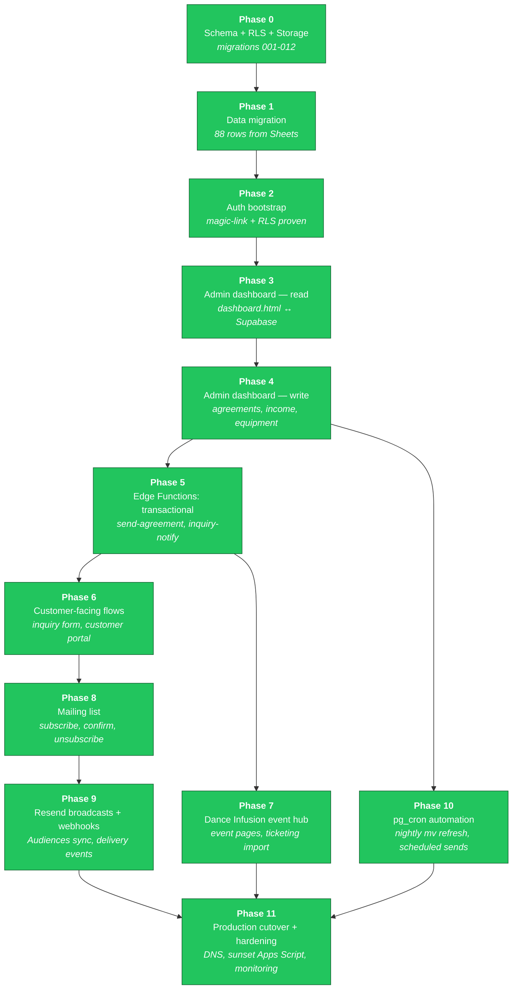
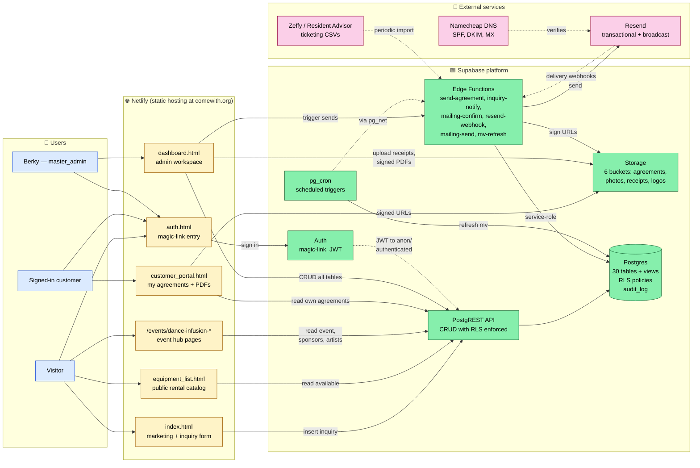

# Come With — Platform Roadmap

This document is the single source of truth for the Supabase migration plan
and the target architecture. Status colors and arrows are current as of
**2026-05-28** (Phase 2 close).

The phase numbering below is a **redesign** of the original Claude-generated
plan. Original used 0-12 with several phases (4, 6, 7, 10, 11, 12) never
specified; "frontend rewrites" was lumped into a single Phase 3 even though
the work spans admin tools, public pages, and an Edge Function backend.
This version uses 12 phases (0-11) with each phase being independently
shippable on staging.

**Status as of 2026-05-28 close of Phase 11**: ALL PHASES DONE. Migration
complete. comewith.org is live on Supabase prod. Known issues + redesign
items collected in project-phase-11-status memory.

---

> ## ⛔ PRIORITY CONTEXT (read first)
> **Come With is MAINTENANCE-ONLY.** The **CWF (Come With Fitness) BRD** is project #1 —
> **due June 15, 2026**. Nothing Come With Fitness goes in *this* repo
> (dashboard / schema / pages) until the BRD is done **and** there's an explicit go
> (LEARNINGS §5). Everything below is the Come-With dev roadmap, reconciled **2026-06-02**.

---

## Phase roadmap

### Phase descriptions and dependencies

| # | Name | What it produces | Depends on |
|---|---|---|---|
| 0 ✅ | Schema + RLS + Storage | 30 tables, helper fns, audit triggers, 6 buckets, RLS policies | — |
| 1 ✅ | Data migration | 88 rows imported from Google Sheets (clients, contractors, equipment, expenses, income) | 0 |
| 2 ✅ | Auth bootstrap | magic-link configured, Berky=master_admin, RLS isolation proven | 0 |
| 3 ✅ | Admin dashboard — read | `dashboard-v2.html` reads from Supabase (all 7 admin tables: inquiries, agreements, clients, income, expenses, equipment, events). Magic-link login. No writes yet — read-only de-risks the schema before exposing edits | 2 |
| 4 ✅ | Admin dashboard — write | Inquiry status writes, agreement status writes, "Add income" modal, "Add expense" modal with receipt upload to Storage. Daily ledger work runnable from the dashboard. Full CRUD on clients/equipment/events deferred to 4.5 or Phase 7 | 3 |
| 5 ✅ | Edge Functions: transactional | `send-agreement` (creates token, emails sign link via Resend, marks agreement sent), `get-agreement-by-token` (public, returns agreement for signing page), `mark-signed` (records typed-name signature, notifies all master_admins). `sign.html` customer signing page. Web-based signing — no PDFs. `inquiry-notify` deferred to Phase 6 alongside the public form | 4 |
| 6 ✅ | Customer-facing flows | `index-v2.html` public inquiry form (anon insert via `return=minimal` workaround), `customer_portal-v2.html` shows signed-in customer's agreements with "Review & sign" deep link, `inquiry-notify` Edge Function emails master_admins on new submission. **Anon-RLS resolved** — was a `Prefer: return=representation` quirk, not a policy bug | 5 |
| 7 ✅ | Dance Infusion event hub | DI2 seeded (1 venue, 1 event, 9 sponsors+sponsorships, 5 artists+bookings, 5 raffle prizes, 4 expenses, 16 RA tickets). `events/dance-infusion-2/index-v2.html` public hub via `get-event-hub` Edge Function. Dashboard-v2 admin tabs for sponsors/sponsorships/artists. `import_ticketing.py` CSV importer (RA + extensible for Zeffy) | 5 |
| 8 | Mailing list | Public subscribe form, double-opt-in confirmation, unsubscribe via tokenized URL, segments. Self-hosted per decision #8 | 6 |
| 9 | Resend broadcasts + webhooks | Audiences sync, campaign drafting UI, send queue, webhook handler for `delivered`/`bounced`/`complained` → `mailing_events` table | 8 |
| 10 | pg_cron automation | Nightly materialized view refresh, scheduled mailing sends, audit log retention, weekly digest emails. Lives in `automation_jobs` table; pg_cron calls Edge Functions via pg_net | 4 |
| 11 | Production cutover + hardening | Run migrations on `comewith-prod`, DNS swap if needed, Netlify env vars updated, Apps Script triggers disabled and code archived, monitoring dashboards, backup verification | 7, 9, 10 |

**Why this re-decomposition vs. the original:**

- Original Phase 3 = "frontend rewrites + real-time admin dash" tried to fit
  every HTML page rewrite into one phase. In practice that's weeks of work.
  Splitting into admin-read (P3), admin-write (P4), customer-facing (P6), and
  event hub (P7) lets each ship and prove itself independently.
- Edge Functions weren't in the original plan as their own phase — they were
  implicit in "Phase 9: pg_cron + Edge Functions". But transactional functions
  (send agreement, inquiry notification) need to exist before the customer-
  facing pages can rely on them (P5 → P6).
- Original Phase 5 = "production cutover" was placed early, but it can't
  meaningfully happen until P10 (automation) is verified on staging. Renamed
  P11 and pushed to the end where it belongs.
- Phases 4, 6, 7, 10, 11, 12 in the original were never specified. This
  proposal fills them.

---

## End-state architecture

This is the target state after Phase 11. Apps Script + Google Sheets do not
appear — they're sunset by then.

### Request-flow examples

| Scenario | Path through the system |
|---|---|
| New website inquiry | `index.html` → PostgREST → `inquiries` table (anon INSERT policy) → Resend trigger via `inquiry-notify` Edge Function → Berky's email |
| Customer signs agreement | Berky drafts in `dashboard.html` → PostgREST → `agreements` (admin policy) → `send-agreement` Edge Function generates PDF → uploads to `agreements` Storage bucket → Resend sends signing link → customer clicks tokenized `agreement_links` URL |
| Customer logs in | `auth.html` magic-link form → Supabase Auth sends email → click sets JWT → `customer_portal.html` reads JWT, calls PostgREST with `auth.uid()` → RLS filters `agreements` to their own client only |
| Nightly KPI refresh | `pg_cron` job fires at 03:00 → `pg_net` calls `mv-refresh` Edge Function → function executes `refresh materialized view concurrently mv_cross_event_kpis` (and the other two MVs) |
| Bounce handling | Resend webhook → `resend-webhook` Edge Function (verifies signing secret) → inserts row in `mailing_events` → if event is `bounced`/`complained`, updates `subscribers.status` |

---

## How to read status colors

- 🟢 **green** — phase complete, validated on staging
- 🟡 **yellow** — phase is the next one up, not started
- ⚪ **gray** — planned, dependencies not yet met

Update the `class P# done|next|planned` lines in the Mermaid block as phases
progress. The mermaid diagrams render natively on GitHub and in VSCode/Cursor
preview — no build step required.

---

## Current state — reconciled 2026-06-29 (Impact report public + Pricing + Surveys)

> Migrations **067–074 all APPLIED to prod**; edge functions **survey-get / survey-submit /
> survey-send deployed** + **send-campaign redeployed**; `dashboard.html`, `index.html`,
> `survey.html`, and the DI#2 `impact-report.html` / `public-audit.html` pushed (Netlify live).

### ✅ Impact report → public, Supabase-backed (067)
- `events.impact_report` (jsonb) + `events.impact_report_public` (publish toggle) + anon `v_public_impact_report`.
- Event-hub **"Impact report" editor** (text, hero + inline photos, toggle). DI#2 report + public audit
  rewritten to read Supabase (localhost JSON fallback); `/staging` gate retired — the toggle is the gate.
- Homepage `#di` **"Read the #2 Impact Report"** button when published.
- Content locked: attendance **117**, DI#1 sponsors **0**, reach removed, audit goal **50%**, Yankees donor =
  New York Yankees; human-moment quote + DI#3 copy render from saved content. **DI#2 report is published.**

### ✅ Pricing tool (068, 070) — Sales, between Inquiries & Agreements
- `pricing_config` (admin single-row) + `module_registry` 'pricing'; pure engine `assets/pricing-engine.js`
  (+ `scripts/test_pricing.mjs`, 14 passing tests).
- Quote builder: DJ / rental (live from `equipment_inventory.daily_rate`) / labor / lighting / **travel
  (mileage + drive time)** / surcharges; editable defaults + per-DJ overrides; copy + print/PDF.
- **Link a quote to an event** (`events.quote` jsonb, 070), or save with no event → creates a planning event.

### ✅ Survey system (071, 072, 073)
- `surveys / survey_questions / survey_invites / survey_responses / survey_answers` (admin RLS) + anon `v_public_survey`.
- Edge fns: `survey-get` / `survey-submit` (public; token = invite or public; tags response to
  event/actor/guest/subscriber) + `survey-send` (admin; tokenized invites + Resend).
- Public `survey.html`; dashboard **Surveys** module (Audience) — builder + results filterable by event/person.
- Wired to the **impact report** (button) and to **campaigns** (073 `mailing_campaigns.survey_id`; per-recipient
  tokenized link in send-campaign; `{{survey}}` / `{{survey_link}}` placement). First DI#2 feedback survey is open.

### ✅ Campaigns
- Edit any not-yet-sent campaign; **CC** (069 `mailing_campaigns.cc`); attach a survey; rows show a 📋 survey
  badge; plain-text line-breaks render as ` `; survey shows in test send + preview.

### ✅ Event hub + ops
- **Guest list (expected customers)** on the Customers tab — searchable picker of existing guests/contacts +
  add-new + remove; the Customers list itself is searchable.
- **Equipment load-in checkoff** (074 `equipment_usage.loaded_at`) — persistent checkboxes, "X/Y loaded", Mark all.
- Fix: event hub reloads `audited` / `financials_released` (toggles saved but weren't re-read on refresh).
- Fix: content/showcase events show **net P&L** in the Events "Result" column (Crossroads −$1,400 was hidden).

### ✅ Other
- **Social calendar email** (✉️) — inline-HTML snapshot via `send-notice` + recipient picker (team + contacts).
- **Users** access chips colour-coded: blue = role default, green/red = grant/revoke override.
- **Homepage collective** = portrait **photo cards** (artist profile photo) instead of chips.
- **Pop-out fix:** removed click-outside-to-close (a drag-select ending off the box was dismissing forms) —
  close via Cancel / Esc only.
- **Workflow map** gained Quote/Pricing, Email campaign, and Survey/feedback steps (auto-numbered by position).

### ▶️ Open / next
- **Release to staff** (flip `signed_off` in Team → Modules): **Pricing, Surveys, Templates** are built-but-not-
  signed-off (master-only today).
- Add artist **photos** for the new collective cards; flip more artists onto the collective.
- External TODO still open: verify comewith.org as a sending domain in Resend before the first real blast.

## Current state — reconciled 2026-06-26 (Customer site LIVE + artist profiles)

> **Priorities/sequencing owned in the planning chat; this file = dashboard execution backlog.**
> Migrations **061–065 all APPLIED to prod**; edge function **artist-self deployed**; `index.html`,
> `watch.html`, `artist.html`, `artist-edit.html`, `dashboard.html` all pushed (Netlify live).
> Backup of the pre-redesign homepage: `backups/index.html.pre-redesign-2026-06-26` + tag
> `backup/2026-06-26-pre-frontend`.

### ✅ Done / LIVE on prod — public site went live (2026-06-26)
**The homepage is now the new customer site.** The old 916 KB `index.html` was replaced by a
content-driven dark "V4 hybrid" (dark Pulse base + Dance Infusion impact block + production lane).
- **Tiny CMS** (062 `site_content`, anon-read, write gated to `site-editor` module / master): every
  public text element is `data-cw`-tagged and overridden from the DB. **Site Editor** dashboard module
  edits all keys grouped into collapsible sections + a **logo system** (one upload, CSS mask auto-tints
  the brown logo to blend; updates everywhere). Donate/Ticket buttons are grouped "button cards"
  (show toggle + text + link); `$` donation tiles have a show/hide toggle that enlarges the impact card.
- **Watch page** (`watch.html`): recap videos as a gallery (YouTube + SoundCloud, lightbox).
- **Recap content** (061 `events.is_featured/youtube_url/recap_blurb` + `v_public_recap`; 063
  `events.recap_videos` jsonb): per-event Featured toggle + hero photo + **multiple** recap links
  (YouTube **and SoundCloud**), each with a custom label and **taggable to an artist**. Powers homepage
  Recent Rooms + Watch page.
- **Upcoming events show their hero photo** (064 — `v_public_events` now exposes `hero_image_path` +
  `series`; homepage event cards render a banner).
- **Photo pipeline**: HEIC→JPEG in-browser (heic2any), auto landscape-fit (16:9 blurred-fill so nothing
  crops), in-modal current-photo preview + **Remove photo**; bucket `event-photos` raised 5→15 MB + SVG.

### ✅ Done / LIVE on prod — artist profiles + collective (2026-06-26, migration 065)
`actors` gained `bio, photo_path, soundcloud, tiktok, public_profile, collective_rank, edit_token`.
Public anon views: **v_public_artists** (the collective), **v_artist_gigs** (from `event_participants`,
public/completed only), **v_artist_content** (unnests `recap_videos` tagged with an `artist_id`).
- **Public profile page** (`artist.html?id=`): photo, bio, socials (IG/SoundCloud/TikTok/web), Content
  grid (tagged recap media + lightbox), gig history.
- **Homepage collective** loads from `v_public_artists` — clickable avatar chips → profile. Currently
  **only Berky + KRNeY** are public (others toggled off but retained).
- **Dashboard Artists tab → profile editor**: show-on-collective toggle, **DJ name vs. real name**
  (only DJ name shows), order, bio, socials, photo upload/remove, bookings. Recap videos tag to artists.
- **Self-service**: `artist-self` edge fn (token-gated get/save/photo, `--no-verify-jwt`) +
  `artist-edit.html?token=` (no-login page) + dashboard **Copy / Email update link** (via `send-notice`).
- Homepage content: **removed the daytime "community" section**; **editable ticker** (`strip.items`,
  now Music · Rave · Community · Daytime · Dance Infusion · Brooklyn).

### ✅ Bug fixes (2026-06-26)
Dashboard **dark theme** now matches the site. **Active tab persists** across saves/refresh
(localStorage). **Backspace** outside a field no longer navigates the browser back. **Enter** in the
edit modal no longer submits/closes it. Events summary table gained a **Public** column, clearer
status colours (green = completed only; `on_sale` → teal) and `0`-vs-`—` for completed events.

### ▶️ Open / next (this thread)
- Fill in artist Instagram / SoundCloud / TikTok handles (Keith has them); optionally email artists
  their self-update links. Set a real **Donate link** (and Tickets when an event is on) in Site Editor.
- Add a real **DI #3** event (October) when planned; feature it + add recap content afterward.
- Offered but not built: a "Edit public profile →" shortcut on the **Actors** page for dj/artist rows.

## Current state — reconciled 2026-06-24 (Operations + CRM build-out)

> **Priorities/sequencing owned in the planning chat; this file = dashboard execution backlog.**

### ✅ Done / LIVE on prod — operations + CRM build-out (2026-06-24)
Migrations **045–051 all APPLIED to prod**; `dashboard.html` pushed (Netlify live); `send-campaign` redeployed.

**Actor model is now the single source of truth.**
- **047 — legacy person/org tables RETIRED**: dropped `clients`, `sponsors`, `artists`, `contractors`,
  `artist_bookings`, `artist_notes` (+ orphaned `v_sponsor_history`/`v_artist_history`/`mv_repeat_sponsors`/
  `mv_top_artists`; trimmed the MV refresh cron). `inquiries`/`agreements`/`income`/`mileage` actorized
  (`actor_id`; customer-self RLS repointed). Entire dashboard reads `actors` — Sponsors/Sponsorships/
  Clients/Artists tabs + every picker. **No legacy-table references remain.**
- **Actors management tab** (048 `actors.status`; 049 `actors.org_id` + widened role vocab): one
  inline-editable, sortable table — add / on-hold / archive, role chips, multi-select role + kind filters,
  person→org affiliation, org→venue assignment. (Closes the "Sponsor/Artist/Vendor tab repoint" backlog items.)

**Event hub.**
- **Files tab** (045 `document_types` + `files.vendor_actor_id`): replaced Contracts; doc-type buckets
  (+ add custom), per-bucket upload, vendor = vendor-role actors only, surfaces contract-attached files
  (recovered the "lost" Signal contract).
- **Customers tab**: deduped union of participants/attendees/donors/sponsors with ticket counts + reconciliation block.
- **Overview**: type-aware (Come With Production = service framing); **Engagement & marketing** section
  (per-event IG snapshots back-dated via Log-IG; marketing spend); checklist moved to bottom.
- **Equipment** (046 `equipment_components` + `wishlist` status): inventory reconciled to the Financial
  master — serials, 6 buckets (DJ/Sound/Camera/Misc/Wire/Accessories), prices; fixed 3 wrong "retired";
  edit modal + usage history; **gear bundling** (parent↔child, auto-included on event assignment);
  wishlist; category filter on the assign popup. (Closes "Full Equipment module".)
- Venue event-history; richer Edit-core (venue **auto-fills capacity**, doors/end/description);
  new series **Come With Production** + **Content Creation** (+ `seriesToType()` keeps `events.type` in sync).

**Money / KPIs.**
- **DI#1 + DI#2 fully itemized & tied to the audit** (tickets→`ticketing`, donors→`third_party_donations`,
  per-buyer→`guest_event_attendance`); historical events backfilled (Maxwell→production, showcases→content,
  DJs incl. SPF 50). DI#1 net = $1,140-to-MS exactly.
- **Events page rebuilt as the command center**: aggregates in **three separate money models**
  (Come With Parties / Production & content ≈net-$0 / Dance Infusion charity), type-adaptive per-event
  "Result", filters (series/status/year/search/**completed-only**), split marketing cards.
- **Expenses → events** (050 `event_na`): inline event dropdown, N/A-overhead flag (Software/Equipment
  auto-N/A), clean "needs an event" list; **Simplifi import** (Category='Work Expenses', deduped, 63 added,
  5 auto-assigned, tagged `[simplifi 0624]`).
- **Strategy KPI fix** (051 `v_kpi_computed`): event-derived cards (di.*/parties.*) compute **LIVE**
  (completed-only) instead of null; +4 cards (To MS total, Net P&L total, Mailing list, Repeat attendees);
  "last updated" on cards; **audience + attendance trend sparklines**.

**Email / campaigns** (stack already deployed): fresh `RESEND_API_KEY` set; `send-campaign` gains
**test-send** + per-campaign **stats**; Campaigns tab segment picker + preview + audience confirm.
**External TODO before first blast: verify comewith.org as a sending domain in Resend.**

**Open / offered (not built):** YouTube/Instagram auto-pull API (need YT API key + channel ID / Meta app +
IG Business token); in-app Simplifi importer; ~12 small "needs an event" expenses (Elements) for Keith to N/A;
optional sortable Events headers + follower-growth-vs-prior-event delta.

### ✅ Done / LIVE on prod — staff access + social calendar (2026-06-23)
- **Migration 041 — staff access model** (APPLIED to prod): data-driven, grouped nav
  (**Sales / Operations / Finance / Partners / Audience / Insights**) rendered from
  `module_registry`; `profiles.staff_role` (`operations` / `marketing` / `full`);
  `module_registry` + `user_module_access` (+ RLS); `user_can_access_module()` helper.
  Client-side **signed-off badge gate** (non-master staff see only modules that are
  signed off **and** in their role scope, with per-user grant/revoke overrides) and a
  master-only **Team tab** (set roles, per-user access, and flip module sign-off).
  Existing sub_admin (liz@comewith.org) backfilled to `staff_role='full'`.
  **Signed off so far: Events, Team, Social Calendar** (everything else built-not-released).
- **Migration 044 — Social Calendar** (APPLIED to prod): `social_posts` + `social_post_notes`
  with **real per-module RLS** (clean leaf tables, no Events-hub coupling, so RLS was safe to
  apply here). Stage pipeline idea→drafted→review→planned→scheduled→posted→archived;
  **Timeline (default) / Board / List** views; full post CRUD; **threaded, timestamped notes**;
  read-only **snapshot export** (self-contained chronological timeline → Print / Save-as-PDF)
  to share with collaborators (e.g. Janelle) **without a login**.
- **Deployed:** `staff-access-model` merged to master (`8fa2a62`), pushed; Netlify serving the
  new `dashboard.html` to comewith.org. DB migrations **041 + 044 applied to prod**; the nav
  also added a Social Calendar module and a master-only Team module.

### ✅ DONE — staff access security APPLIED + staff logins created (2026-06-25)
All five steps shipped in one session (commit `a668661`):
1. **042 APPLIED** (per-module RLS) — **rewritten** for the post-047 actor model (the original
   draft referenced the dropped clients/sponsors/artists). Gates `actors`/`actor_roles`/
   `event_participants` (+ contracts/files/document_types); `[VERIFY]` policy names resolved
   against live prod; Events-hub carve (`can_use_events_module()` + new `can_see_people()`) intact.
2. **043 APPLIED** — **two-flag** financial gate (per Keith): `events.audited` (master-only,
   informational) + `events.financials_released` (master-only) — staff see an event's money
   **only when released**. Base-table RLS on income/expenses/mileage/ticketing/sponsorships/
   donations; money columns CASE-gated in `v_event_summary`; `security_invoker` on all **6** money
   views via `ALTER VIEW` (reconciled with 051's `v_kpi_computed` — no risky drops); anon-revoke
   re-asserted. Guard trigger blocks non-master from flipping either flag. Dashboard event hub has
   a master-only **Financial visibility** block (audit toggle + release switch; release pops a
   confirm every time, **loud red when not audited**).
3. **`invite-user` DEPLOYED.**
4. **Staff logins created** — **martin@comewith.org** + **henry@comewith.org** (both `sub_admin` /
   `operations`). (Janelle/marketing not created yet.)
5. **End-to-end gate test PASSED 17/17** (against a full seeded demo event, since cleared): anon →
   401 on all 6 views; master sees money pre-release; staff blocked (income/expenses 0 rows, view
   money NULL, company `event_id IS NULL` rows invisible); staff PATCH release → guard 400; master
   releases → staff then sees that event's money but **never** company-level finance.

**GATED BLOCKER now CLOSED (055, 2026-06-25):** `v_budget_variance` / `v_data_points` /
`mv_event_data_points` revoked from anon + authenticated (none used by the dashboard; master
reaches financials through the gated event views). income/expenses **writes** stay master-only (D1)
per Keith — loosen to `can_use_events_module()` later if ops staff should log event expenses.

### ✅ DONE — Email any actor/venue + Conversations (2026-06-25, migration 056, commit 4abe2b1)
Email from Actors / Vendors / Venues / event-hub People (individual + multi-select) via a shared
compose modal (subject tagged with source, body deep-links back via `?goto=`). Every send logs a
**Conversation thread** (056 tables + RLS: team-visible unless 🔒 restricted to master+creator+ACL;
new signed-off **Conversations** module). `send-actor-email` Edge fn (Resend); `resend-webhook`
extended to log **delivery/bounce** status into threads. Conversations screen = list → thread (reply,
internal note, visibility, go-to-source). Verified e2e on prod (delivered + bounced + restricted
visibility across martin/henry). **Residual:** inbound human-reply auto-capture needs Resend inbound
+ MX (external); replies currently land in berky@comewith.org's inbox (reply_to) — paste as a note.

### 🔁 Carrying forward
- **Round-2 module sign-off (ongoing process)** — as Keith reviews each module, flip it
  `signed_off` from the Team tab to release it to the staff roles whose scope includes it.
  Only **Events / Team / Social Calendar** are released today; the rest are built but gated.
- Events Services Agreement bug fixes + dashboard filter/sort (tracked under "Still-open bugs");
  MSA e-signatures (tracked under "Parked" — still hard-blocked by the financial-view fix below).

### ✅ Done / LIVE on prod — cumulative (through 2026-06-16)
- **Migration & cutover (0–11) + KPI/metrics + money model (015–022)** — Strategy tab, entry forms
  (Log Event / Numbers / Edit Target + create/retire-metric), feedback log + Notes, event edit +
  soft-delete, Add Sponsor, per-event Money panel; canonical revenue/P&L (net P&L incl. tickets).
- **DI #2 impact report + public audit + reusable `/staging/` gate** — "% to mission" framing,
  founder-contribution note. Gated; **not yet public** (consent sweep — see Parked).
- **Data architecture 023–028 APPLIED to prod AND POPULATED with reconciled DI data** — actors /
  roles / event_participants, content_items + tags, workflow (tasks / templates / contracts / files /
  budget_lines + variance / touchpoints), metric_definitions + v_data_points (+ nightly rollup).
  DI#1 loaded at **39% to mission**, DI#2 at **31%**; role-overlap proven (Keith = dj+donor+sponsor+
  team; Crossroads = vendor+sponsor); 17 actors, 5 DI#2 DJ participants, 12 sponsorships; no dup
  actors; anon-401 holds. (`events/dance-infusion/DI_DATA_LOAD_LOG.md`.)
- **Migration 029** — `sponsorships.sponsor_id` nullable (sponsorships attach to actors) + `actor_roles` `donor` role.
- **Tools deployed + admin-gated** on comewith.org — `/tools/actor-inspector|test-checklist|visualizer.html`.
- **MODULE SERIES — Event Hub & Guest layer (migrations 030–040), all live on master/Netlify:**
  - **Event Hub** (sprints 1–2): per-event detail page — Overview/People/Tasks/Money/Equipment/Contracts/Files,
    stage stepper, day-of generator, multi-role participants (`roles[]`), audit triggers, `v_actor_full`,
    bulk add/edit, inline Money fix, contract docs, IG-followers KPI capture.
  - **Venue / contact matrix** (sprint 3a): Venues tab, `venue_contacts`/`vendor_contacts`, "last time" lookup.
  - **Conditional workflows + template editor** (sprint 3b): `events.cw_providing_gear`, gear-aware generation,
    outreach templates auto-assigned via the matrix, in-dashboard Templates editor (future-only), grouped assign picker.
  - **Chain fix** (sprint 4): venue-save display fix, ONE gear task + equipment sheet, venue-as-counterparty
    (`venues.actor_id`), delete-stays-deleted; actors-only historical backfill (DI#1/showcase participants, Signal contacts).
  - **Attendee + Guest module** (sprints 5–7): `guests`/`subscribers`/`guest_event_attendance`, DI#2 ledger import
    (people-only, money never written), guest→actor graduation (`guests.actor_id`), Guests tab w/ lifetime stats +
    filters (subscribed = mailing list), returning-attendee KPI **fixed (fuzzy name+email; DI#2 returning 1→12)**,
    mission/business spend split (DI = MS-Society mission vs CW Parties business).
  - **Counts (prod):** guests **97**, subscribers **86** subscribed (11 opt-out-respected), actors **38**, attendance **108**.
  - **Money discipline held:** no financial rows written from any backfill; DI#1/DI#2 `v_event_summary` unchanged throughout.

### 🟡 Held (committed locally, push held for Keith)
`261797d` (029 + DI load log), `5cbb51e` (roadmap backlog). (Module-series work 030–040 is pushed to master.)

### 🚫 GATED BLOCKER (hard dependency — keep)
**Financial-view security fix — BEFORE any customer/external login:** revoke the 5 financial views
(+ `v_budget_variance`, `v_data_points`, `mv_event_data_points`) from `authenticated`, re-issue as
`security_invoker` over RLS-gated tables (non-admins get ZERO rows); negative tests pass on staging
first (`tools/test-checklist.html` → Security 🔴). ⚠ Covers **existing `customer`-role logins too**
(they're `authenticated`; views revoked from `anon` only today). The dormant actor-self RLS tier is
built (024/026) but **no non-admin login is provisioned**.
>
> **⚠ Update 2026-06-23 — staged migration 043 is the START of this fix, not the whole thing:**
> 043 rebuilds the **5 money views** (`v_event_summary`, `v_kpi_event_financials`, `v_kpi_parties`,
> `v_kpi_dance_infusion`, `v_kpi_dashboard`) as `security_invoker` and gates them on
> `is_master_admin() OR events.audited`. It does **NOT** yet touch **`v_budget_variance`,
> `v_data_points`, or `mv_event_data_points`** — extend 043 (or add a follow-up migration) to cover
> those three before declaring this blocker closed. Also note the **model differs**: 043 implements
> *staff-audited gating* (staff see audited events), whereas this blocker was written for
> *customers/external get zero rows*; reconcile the two intents when applying. As of now **one
> `sub_admin` login (liz) exists** and can still read all of these views via REST — see the staged
> "KNOWN GAP" above.

### 🟦 Queued (dashboard backlog — order owned in planning chat)
1. **Audit cleanup follow-up** — approve the 6 same-human guest↔actor links + review the 8 variant pairs
   in `GUEST_ACTOR_AUDIT.md` (Keith's manual call; includes family records like Francis/Theresa Berkman).
2. ~~Artist module~~ / ~~Vendor module~~ / ~~Sponsor tab repoint~~ / ~~Full Equipment module~~ — **DONE 2026-06-24**:
   legacy tables retired (047), unified **Actors** tab (roles incl. artist/vendor/sponsor + org/venue links),
   and the full equipment module (buckets, edit, usage history, bundling, wishlist) all shipped.
   Remaining slivers: per-role detail tables (`actor_artist_details`/`actor_vendor_details`) if richer
   per-role fields are wanted; equipment **rental ROI / rental-vs-own-use** view.
- Carryover smaller items: actor-inspector "Events" section; Tools nav in the dashboard;
  DI#2 thank-you/survey send; `third_party_donations` actor FK (donations still text `donor_name`);
  YouTube/Instagram auto-pull API; in-app Simplifi importer.

### ❓ Decisions waiting on Keith (block nothing)
- **Cold subscriptions** — keep or drop the ~20 attendees who never ticked RA marketing opt-in.
- **81-name door list** (no emails) — import comps as guests or leave out.
- **Audit merges** — which of the `GUEST_ACTOR_AUDIT.md` same-human links / variant pairs to approve
  (3 flagged pairs are likely *different* people — do not merge).

### ⏸ Parked (each its own session)
- **Actor onboarding + MSA e-signing** — hard-blocked by the financial-view fix above.
- **Roadmap planning tool** — buy not build (Notion vs Trello); separate from this dev roadmap.
- **Flywheel redesign** — `ComeWith_Strategy_Dashboard.html`.
- **`equipment_usage` UI wiring** into the Log Event panel (schema ready in 024).
- **KPI views repoint `series` → `type`** (series exact-match contract kept for now).
- **Impact report → public** — consent sweep (sponsors/team/artists/raffle; Yankees-hats donor) +
  fill placeholders + remove the 2 `/staging/` guard lines; set dashboard `di.cost_to_raise` → 60%-to-mission.
- **Smaller dev items** — Expenses CSV import; per-event line-item editor; reactivate-metric UI;
  `FORM_DEFS` `created_by`-aware handler; DI dashboard `event_date` display fix.

### 🐞 Still-open bugs (re-verify when next in that flow)
- Events Services Agreement (payment-method/recording-rights buttons, fee-total auto-update, client
  auto-populate); dashboard tabs need filter/sort.
