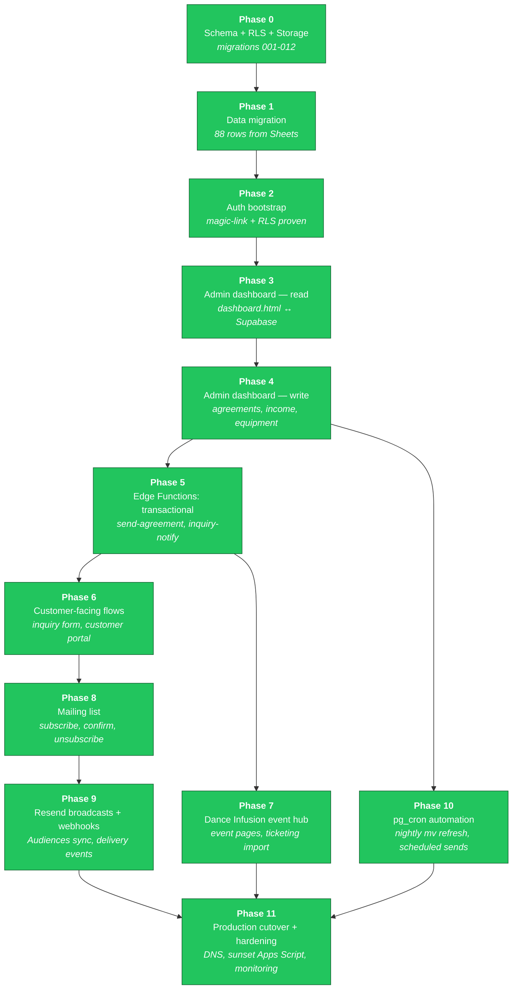
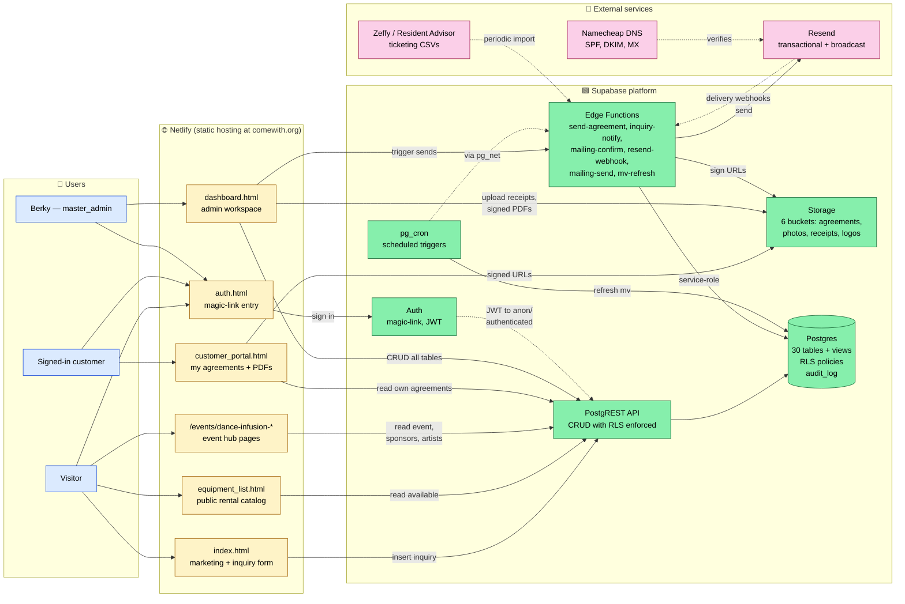

# Come With — Platform Roadmap

This document is the single source of truth for the Supabase migration plan
and the target architecture. Status colors and arrows are current as of
**2026-05-28** (Phase 2 close).

The phase numbering below is a **redesign** of the original Claude-generated
plan. Original used 0-12 with several phases (4, 6, 7, 10, 11, 12) never
specified; "frontend rewrites" was lumped into a single Phase 3 even though
the work spans admin tools, public pages, and an Edge Function backend.
This version uses 12 phases (0-11) with each phase being independently
shippable on staging.

**Status as of 2026-05-28 close of Phase 11**: ALL PHASES DONE. Migration
complete. comewith.org is live on Supabase prod. Known issues + redesign
items collected in project-phase-11-status memory.

---

> ## ⚠ THIS FILE IS STALE (noted 2026-08-15)
> Reconciled **2026-06-02**. It predates the entire Come With Radio build (migrations
> through 139, episode stations, listener accounts, the DICE/Ticketmaster market pulls)
> and the priority framing below is two months past its date. For current state read
> **`CARRYOVER.md`** first, then **`DEV_DOCS/claude-memory/MEMORY.md`**. The architecture
> and phase history below are still accurate as history — the status is not.

> ## ⛔ PRIORITY CONTEXT (read first)
> **Come With is MAINTENANCE-ONLY.** The **CWF (Come With Fitness) BRD** is project #1 —
> **due June 15, 2026**. Nothing Come With Fitness goes in *this* repo
> (dashboard / schema / pages) until the BRD is done **and** there's an explicit go
> (LEARNINGS §5). Everything below is the Come-With dev roadmap, reconciled **2026-06-02**.

---

## Phase roadmap

### Phase descriptions and dependencies

| # | Name | What it produces | Depends on |
|---|---|---|---|
| 0 ✅ | Schema + RLS + Storage | 30 tables, helper fns, audit triggers, 6 buckets, RLS policies | — |
| 1 ✅ | Data migration | 88 rows imported from Google Sheets (clients, contractors, equipment, expenses, income) | 0 |
| 2 ✅ | Auth bootstrap | magic-link configured, Berky=master_admin, RLS isolation proven | 0 |
| 3 ✅ | Admin dashboard — read | `dashboard-v2.html` reads from Supabase (all 7 admin tables: inquiries, agreements, clients, income, expenses, equipment, events). Magic-link login. No writes yet — read-only de-risks the schema before exposing edits | 2 |
| 4 ✅ | Admin dashboard — write | Inquiry status writes, agreement status writes, "Add income" modal, "Add expense" modal with receipt upload to Storage. Daily ledger work runnable from the dashboard. Full CRUD on clients/equipment/events deferred to 4.5 or Phase 7 | 3 |
| 5 ✅ | Edge Functions: transactional | `send-agreement` (creates token, emails sign link via Resend, marks agreement sent), `get-agreement-by-token` (public, returns agreement for signing page), `mark-signed` (records typed-name signature, notifies all master_admins). `sign.html` customer signing page. Web-based signing — no PDFs. `inquiry-notify` deferred to Phase 6 alongside the public form | 4 |
| 6 ✅ | Customer-facing flows | `index-v2.html` public inquiry form (anon insert via `return=minimal` workaround), `customer_portal-v2.html` shows signed-in customer's agreements with "Review & sign" deep link, `inquiry-notify` Edge Function emails master_admins on new submission. **Anon-RLS resolved** — was a `Prefer: return=representation` quirk, not a policy bug | 5 |
| 7 ✅ | Dance Infusion event hub | DI2 seeded (1 venue, 1 event, 9 sponsors+sponsorships, 5 artists+bookings, 5 raffle prizes, 4 expenses, 16 RA tickets). `events/dance-infusion-2/index-v2.html` public hub via `get-event-hub` Edge Function. Dashboard-v2 admin tabs for sponsors/sponsorships/artists. `import_ticketing.py` CSV importer (RA + extensible for Zeffy) | 5 |
| 8 | Mailing list | Public subscribe form, double-opt-in confirmation, unsubscribe via tokenized URL, segments. Self-hosted per decision #8 | 6 |
| 9 | Resend broadcasts + webhooks | Audiences sync, campaign drafting UI, send queue, webhook handler for `delivered`/`bounced`/`complained` → `mailing_events` table | 8 |
| 10 | pg_cron automation | Nightly materialized view refresh, scheduled mailing sends, audit log retention, weekly digest emails. Lives in `automation_jobs` table; pg_cron calls Edge Functions via pg_net | 4 |
| 11 | Production cutover + hardening | Run migrations on `comewith-prod`, DNS swap if needed, Netlify env vars updated, Apps Script triggers disabled and code archived, monitoring dashboards, backup verification | 7, 9, 10 |

**Why this re-decomposition vs. the original:**

- Original Phase 3 = "frontend rewrites + real-time admin dash" tried to fit
  every HTML page rewrite into one phase. In practice that's weeks of work.
  Splitting into admin-read (P3), admin-write (P4), customer-facing (P6), and
  event hub (P7) lets each ship and prove itself independently.
- Edge Functions weren't in the original plan as their own phase — they were
  implicit in "Phase 9: pg_cron + Edge Functions". But transactional functions
  (send agreement, inquiry notification) need to exist before the customer-
  facing pages can rely on them (P5 → P6).
- Original Phase 5 = "production cutover" was placed early, but it can't
  meaningfully happen until P10 (automation) is verified on staging. Renamed
  P11 and pushed to the end where it belongs.
- Phases 4, 6, 7, 10, 11, 12 in the original were never specified. This
  proposal fills them.

---

## End-state architecture

This is the target state after Phase 11. Apps Script + Google Sheets do not
appear — they're sunset by then.

### Request-flow examples

| Scenario | Path through the system |
|---|---|
| New website inquiry | `index.html` → PostgREST → `inquiries` table (anon INSERT policy) → Resend trigger via `inquiry-notify` Edge Function → Berky's email |
| Customer signs agreement | Berky drafts in `dashboard.html` → PostgREST → `agreements` (admin policy) → `send-agreement` Edge Function generates PDF → uploads to `agreements` Storage bucket → Resend sends signing link → customer clicks tokenized `agreement_links` URL |
| Customer logs in | `auth.html` magic-link form → Supabase Auth sends email → click sets JWT → `customer_portal.html` reads JWT, calls PostgREST with `auth.uid()` → RLS filters `agreements` to their own client only |
| Nightly KPI refresh | `pg_cron` job fires at 03:00 → `pg_net` calls `mv-refresh` Edge Function → function executes `refresh materialized view concurrently mv_cross_event_kpis` (and the other two MVs) |
| Bounce handling | Resend webhook → `resend-webhook` Edge Function (verifies signing secret) → inserts row in `mailing_events` → if event is `bounced`/`complained`, updates `subscribers.status` |

---

## How to read status colors

- 🟢 **green** — phase complete, validated on staging
- 🟡 **yellow** — phase is the next one up, not started
- ⚪ **gray** — planned, dependencies not yet met

Update the `class P# done|next|planned` lines in the Mermaid block as phases
progress. The mermaid diagrams render natively on GitHub and in VSCode/Cursor
preview — no build step required.

---

## Current state — reconciled 2026-08-19 (FP&A close-out: 1099s, gear, photo library, Blue Sky)

**Done this pass**
- 🟢 **1099 tracking** — `v_contractor_1099`, per payee per year across all categories.
  Reportability stored on `actors.tax_1099_status`; unreviewed payees over $600 surface
  as a working list. One open item: Janelle Sochet, $900.
- 🟢 **Expense ledger reconciled** — missing XDJ-AZ added, $2,031.08 of gear
  recategorised, three 2024 charges confirmed, one $900 duplicate removed. Equipment
  now exceeds the theft, which it did not before. Net loss $31,334.20, invested capital
  $34,885.26.
- 🟢 **Venmo-as-actor removed** — a payment rail was seeded as a payee by 158.
- 🟢 **Bulk-edit selection bug fixed** — selections were writing to rows hidden by the
  filter. The most consequential fix of the session.
- 🟢 **Delete fixed** — `NL` scoping meant the ✕ and bulk Delete had never worked.
- 🟢 **Sticky headers + click-to-sort on every data table**, one DOM-level
  implementation; `.main` is now the desktop scroll container.
- 🟢 **Photo library** — photos no longer require an event; subject + photographer +
  credit line; private by default; new Photos tab with a photographer portfolio view.
- 🟢 **Blue Sky pipeline** — `stage = 'idea'` + expected revenue + confidence,
  weighted in `v_pipeline`; `needs_revenue_estimate` flags upcoming events with no
  money on them.

**Parked (needs a decision, not code)**
- 🟡 **Janelle's W-9** and confirmation that 19th & 7th is incorporated — both due
  before the January 2027 filing.
- 🟡 **§83(b) elections** for the 5%-each sweat equity (Martin, Henry, Janelle). None
  vested. If grants exist, the 30-day window is running and cannot be reopened.
- 🟡 **Expected revenue on the 8 upcoming events** — all 8 currently have nothing.
- 🟡 **Review the 10 We Belong Here charges** changed during the selection bug's window.

**Backlog**
- ⚪ Weighted pipeline surfaced in the P&L forecast band (the view exists; the P&L tab
  still reads budget lines only).
- ⚪ Photographer portfolio as a shareable link rather than an in-dashboard modal.
- ⚪ Insurance claim on the theft — still not filed.

## Current state — reconciled 2026-08-18 (Gear Watch: stolen-rig resale scan)

**Not applied, not deployed, not pushed** — held in the desktop working tree at Keith's
green-light for the build, not the deploy. Install order: `DEV_DOCS/GEAR_WATCH.md`.

- **Migration `146_gear_watch.sql`** — `gear_watch_targets` / `_hits` / `_config`,
  admin-only RLS with anon revoked, `gearwatch` module registered **master_only**, three
  pg_cron jobs (8am / 2pm / 8pm ET) calling the edge function through
  `gear_watch_kick()`.
- **Edge function `scan-gear-market`** — Reverb + eBay + Craigslist, scoring, dedupe on
  `(source, listing_id)`, and three alert paths: Resend digest via `send-notice`, the
  dashboard panel, and web push via `send-push` above a configurable score.
- **Confidence model** in `scoring.ts` — gates (model named / not an accessory / posted
  after the theft) then weighted signals, capped at 100, with every award stored in
  `score_breakdown` so a hit can be explained to a detective. **23 tests, no credentials.**
- **Dashboard** — Gear Watch panel (triage, breakdown-visible scoring, status workflow,
  per-target serial entry, manual links for the sites with no API).
- **Craigslist scanned via the site's own internal JSON endpoint** (`sapi.craigslist.org`),
  after the RSS path proved dead. **The only source live-verified end to end** — real NYC
  listings, scored, with resolving URLs. LEARNINGS §27 (which supersedes §24's conclusion).
  Running it live found four bugs no code review would have: a defaulted location, a
  two-index geo string, substring geo matching ("ny" inside "albany"), and a zero-result
  payload that read as FAILED.
- **pg_cron → edge function auth settled** (service-role bearer from vault), closing the
  question deferred in `014_cron.sql` since Phase 10. LEARNINGS §25.

Related, same session: `Financial/ComeWith_Stolen_Gear_Loss.xlsx` — the 10-unit loss
schedule serving the detective, the DA's restitution filing and the insurance decision.

## Current state — reconciled 2026-08-15 (Strategy board rebuild: trends, categories, funnel)

**DONE — the KPI layer can finally show a trend.** Migrations 141–145 applied to prod.
- `snapshot_kpis()` + 06:30 UTC cron writes `v_kpi_computed` into `metric_snapshots`, so
  the 27 live-computed metrics build history. Before this they had none, and every
  computed card rendered "– no prior reading" permanently. LEARNINGS §20.
- `v_kpi_prior` (what "prior" means, per metric, in one place), `v_kpi_event_series`
  (per-event values), `v_kpi_content_recent` (last 5 uploads vs the 5 before),
  `v_kpi_changed` (when a number last actually moved).
- `user_dashboard_prefs` replaces the shared singleton — hidden cards and open categories
  are per person now.

**DONE — the board reads as six categories, not 35 cards.** Parties · Dance Infusion ·
Audience · Content · Radio · Site, each leading with two health numbers and one chart,
collapsed by default, expanding to everything that used to be on the page. Plus an alerts
row (deterministic rules), source badges on the card face, and deltas that name what they
compare against. Radio and Site became their own categories. Membership derives from the
metric-key prefix, so a new metric needs no migration. LEARNINGS §21–22.

**DONE (data), PARKED (usefulness) — the funnel.** `v_event_funnel` +
`v_site_exposure_30d` measure site exposure → ticket click → ticket sold → attended. It
reads empty and will keep reading empty until an upcoming event has a `ticket_url`:
the beacon started 2026-07-24, and the only two events that ever had one finished before
that. The ticket CTA lives on the **homepage**, not `event.html`, so clicks are attributed
by matching `link_url` to `events.ticket_url`. LEARNINGS §23.

**PARKED — the flywheel diagram** stays as-is (static, no numbers on the arrows), per
Keith's standing preference for an earlier design he'll describe on revisit. The funnel is
the measured version of the same idea and did not replace it.

**BACKLOG from this work:**
- Per-event funnel history, once enough events have run with the beacon live.
- `youtube.watch_hours` still needs the YouTube Analytics API + OAuth; unchanged.
- Instagram auto-pull still not built; all IG numbers remain hand-logged.
- The five duplicate `kpi_targets` rows were deactivated, not deleted — if targets need
  re-tuning, do it from the dashboard's "Edit target", never in SQL.

## Current state — reconciled 2026-07-28 (Radio ecosystem + Content Center + NYC Scene control center)

> Big build-out since the 2026-07-23 radio close. Migrations **107–132 applied to prod**;
> new pages `dj.html`; new edge fns `sc-match`, `dj-station`, `pull-dice` deployed.

### ✅ Come With Radio — bookends, genre/release, artist matching
- YouTube render: staged **intro + closing** "story" slides, overlaid on the mix so
  runtime is unchanged; per-track **genre + release-date** line (`Radio/render/`).
- **sc-match** edge fn resolves a SoundCloud profile from an artist name
  (conservative). "↻ Refresh music & data" fills DICE/TM/no-link artists (all
  sources) then scans; 🛒 Beatport catalog on every artist; **NYC-local** city
  from SC (128) → 📍 tag + filter.
- **DICE** market source (`pull-dice`, reverse-engineered, source-isolated).

### ✅ NYC Scene control center (Best Nights reworked)
- Tabbed (Overview / Artists / Venues) with an always-on **coverage snapshot**
  (events/artists per source, songs, NYC, venues). Multi-source **Buzz** score,
  sortable/filterable explorers, ticketing-platform tags, artist↔venue cross-nav.
- **🗺️ Scene Map** (new internal nav item): Leaflet map of geocoded venues
  (206/235), size = activity, distinct color for **on-the-radio** venues, filters
  (shows/genre/on-radio) + shared-artist web lines. `venues` extended (126/127).

### ✅ Content Center + social calendar
- "➕ Add artist/venue" auto-capture; **editable "Plan a week"** template
  (`site_content ops.content_week`) reachable from Content Center **and** Social
  Calendar. Photo-manager downloads; clip upload fixed (**129**: bucket video MIME
  + 200 MB + stuck-"Saving" fix); floating brief reader; posted posts stay on their
  planned day.

### ✅ Radio episode planning + DJ portal (130–132)
- **Edit any episode** via Control Center ✎ Details; future **'planned' skeletons**;
  **assignment** (user / DJ actor); internal **recap_notes**; episode↔social-post link.
- **DJ scoped link**: `dj.html` + `dj-station` (token-gated, revoke = clear
  `dj_token`) — a DJ sees only that week's scoped artists/songs and can **＋add
  picks** (source='dj', 132). Builder shows a 🎧 DJ-pick badge.
- **Special editions**: multi-day festival series (`edition_name`/`edition_seq`) —
  built for **Come With Elements Radio** (4 daily drops; Martin+Henry+32LVS+Keith).

### ✅ Access / ops fixes
- Janelle (marketing) granted the `events` module so Content Center line items load.
- Removed the incorrect **GetSongBPM** footer credit (data is Rekordbox/Beatport).
- Mobile rebuild (bottom tab bar, full-screen modals, in-app photo/clip upload, PWA).
- EP1 SoundCloud player fixed (embed by track id — survives account moves).

### 📌 One-time
- **EP2 tracklist reconciled** 2026-07-28 — SoundCloud reorder of the shared 39 +
  the 20 website additions appended; nothing removed.

### ▶️ Open / next
- DJ portal: assign 32LVS as a person-actor if not yet in the roster; let DJs
  reorder their picks (currently add/remove only).
- Public **club heat-map** — hold until ≥4 weeks of scene data; keep internal
  triggers off it (the Scene Map is the internal precursor).
- Rekordbox tag-writing (energy/comments back to purchased files) — still parked.

---

## Current state — reconciled 2026-07-18 (Modular nav + master Calendar & Tasks + team chat)

> Migrations **096–098 APPLIED to prod**; `send-actor-email` **redeployed**; `dashboard.html`
> pushed (Netlify live, commits a4f2920…af5acd1). Theme: reshape the dashboard into **sellable
> product modules** and add the cross-cutting Calendar + team-communication layer.

### ✅ Modular product nav (096, 098)
- `module_registry` regrouped into product-shaped, collapsible sidebar groups: **Pinned (Calendar)
  · Workflow · Finance · Marketing · Venues · Artists · Radio · Team HQ** (Site Editor/Review moved
  into Team HQ in 098). Collapse state remembered; active group auto-opens; `actors` relabeled
  "People & Orgs". Groups map 1:1 to what could be sold per-subscriber later — the existing
  built/signed-off/per-user access system already gates them.

### ✅ Master Calendar & Tasks (new pinned module)
- Month grid + agenda: our events (series-colored, day drill-in w/ lineups), **⭐ milestones**
  (`tasks.milestone`, 096 — the only tasks on the grid), social posts, RA/TM market shows,
  roster-artists-playing-elsewhere (name-matched vs `ra_events.lineup`). Multi-select filters:
  series / status / venue / artist + layer toggles.
- **Tasks board** below the grid: first cross-event task view (search, status chips,
  event/assignee/priority/due filters, sort, quick-add, ⭐ toggle) + shared **openEditTask** modal
  (all fields + assignees) reachable from the board, milestone chips, and event-hub task rows.
- Event hub: **"✉ Email task list"** — inline-styled team email (overdue/status sections, message
  intro, live preview, include-done toggle).

### ✅ Team chat + comms (097)
- `chat_channels/members/messages` (team / DM / event threads), member-only DM privacy, **first
  Realtime use** (postgres_changes on `chat_messages`, RLS-filtered) + poll fallback. 💬 on every
  tab; minimize → docked unread pill. Users tab: per-user ✉/💬, multi-select "Email selected",
  teammate emails mirror into the DM thread.
- **Single-thread broadcasts**: `send-actor-email single_thread` mode — one conversation, all
  recipients on one To line; the broadcast posts a notice into # Team chat with "Open thread →" /
  "✓ Complete" (complete removes it from chat; the conversation is permanent).
- Conversations: **"📥 Log received email"** — paste or .eml upload parsed client-side
  (multipart/QP/base64/RFC2047), logged as a real inbound message. No mailbox access.

### ✅ User deactivation (098)
- Master-only Deactivate/Reactivate on Users; `is_admin()/is_master_admin()/user_can_access_module()`
  treat `profiles.deleted_at` as no-role → instant full revoke (verified on prod by impersonation).

### 📌 Lessons banked
- **INSERT..RETURNING enforces the SELECT policy mid-statement** — a security-definer helper that
  re-queries the table can't see the new row; put `created_by = auth.uid()` directly in the policy.
- **Any author CSS `display` beats the `[hidden]` attribute** — reassert `[hidden]{display:none}`
  for styled panels (bit the chat panel/dock/badges).
- RLS is smoke-testable on prod via the Management API: `set_config('request.jwt.claims',…)` +
  `set local role authenticated` inside BEGIN..ROLLBACK.

---

## Current state — reconciled 2026-07-23 (Radio: Rekordbox-first building, listener features, video pipeline, scheduled go-live)

> Migrations **102 · 103 · 104 · 105 · 106 APPLIED to prod**; edge fns
> **track-sources · listener-shows** deployed, **get-station** redeployed. All pushed +
> Netlify-live. Video render pipeline lives in-repo under **`Radio/render/`** (local,
> ffmpeg + Pillow; not deployed). Process map at **comewith.org/radio-workflow.html**.

### ✅ Rekordbox-first station building (102)
- SoundCloud isn't record-quality, so the set is **bought + arranged in Rekordbox**.
  `source` on `sc_playlist_tracks`/`sc_song_log` (`soundcloud`/`manual`/`rekordbox`);
  non-SC tracks get a synthetic `man_…` sc_track_id so dedupe + song memory + carry-over
  still work. **🎛 Import Rekordbox order** (parses the playlist export by header name,
  fuzzy-matches, shows the diff, applies order + BPM/key), **＋ Add song** / ✎ edit (buy
  link + label are private — get-station doesn't select them). SC test-push + ↺ sync KEPT.

### ✅ Where to buy + anon revoke (103)
- **🛒 Where to buy** = `track-sources` edge fn: Beatport (real v4 API, paste-a-token —
  10-min tokens, refresh token unreachable from the browser) + Bandcamp (unofficial,
  best-effort). Fills MISSING bpm/key only; remix/length-aware match guards. `beatport_oauth`
  token store (admin-RLS'd). **Also revoked anon on `sc_playlists`/`sc_playlist_tracks`**
  (carried table grants since 079; RLS was blocking rows so it was `200 []` not data → now 401).

### ✅ Partners role + episode DJ (104, 105)
- **`partners`** staff_role (Henry, Martin, Janelle) = every module EXCEPT master_only
  (income/expenses/strategy/team = the financial wall). Marketing lost Artist Radio.
- **`mix_by`** — who DJ'd the episode; shown on the page/hub + SC description.

### ✅ Public page = final mix only (get-station)
- `get-station` no longer selects `sc_playlist_url`; the public page links the FINAL MIX
  (SoundCloud/YouTube) only. To get the songs, come to the episode page and export.

### ✅ Listener features (radio.html + listener-shows)
- ♡ save exposes each track's SC link; **🎟 Playing NYC soon** (artists you saved with an
  upcoming show — `listener-shows`, server-side so ra_artists stays admin-only); Save all;
  drawer sort Recent/Artist/BPM/Camelot; copy-all-links. **❔ What you get** guide always in
  the nav. Signup opt-in = **`come_with` segment only** (DI never opted in from radio).
  Mobile CSS fixed (nav/nudge/toast). Show-info matching splits collab credits + reads
  remixers; RA-search in the ✎ track editor to attach a remixer's show by hand.

### ✅ Video pipeline — the "Now Playing" YouTube video (local, `Radio/render/`)
- rekordbox's recording `.cue` came out EMPTY + History `.m3u8` has full track lengths not
  mix positions → **`match_mix.py`** recovers timestamps by audio-matching source tracks vs
  the mix (log-mel cross-corr, ±8% tempo, **Viterbi/DP global monotonic alignment**). Keith
  reviews + hand-corrects `tracklist.json`. **`render_episode.py`** (Pillow cards + baked
  progress bar; per-frame ffmpeg geq was too slow for an hour) → per-track slide (cover,
  artist/title, **show date + venue**, up-next). **`make_episode.py --week N`** = one command.
  **Weekly folders**: each episode = `Radio/Week N/` (mix, history, tracklist, video, docs);
  `render/` = tools; heavy media gitignored. EP1 delivered (60:33, 18 tracks).

### ✅ Scheduled go-live (106) + save-YouTube-without-publishing
- **DB-only scheduled publish**: Keith schedules YouTube+SoundCloud on those platforms; the
  site flips the page live at the same time via **pg_cron `radio-publish-due` (every 5 min)**.
  `scheduled_go_live` + `radio_open_next_station()`/`radio_schedule_go_live()` (admin RPC)/
  `radio_publish_station()` (SQL half of finalize — NO SC API push)/`radio_publish_due()`.
  **Functions default to EXECUTE for PUBLIC → revoked from PUBLIC** (SECURITY DEFINER hole),
  verified anon=none. Scheduling **opens next week's station now** (current building→testing
  keeps the one-building invariant) so Keith works ahead + flips via the switcher. ✎ Details
  gained a YouTube link field that **saves without publishing**.

### 🗺️ Flowcharts
- In-dashboard **🗺️ Workflow** (general 5-lane business map) — its radio node now points to
  the radio-specific flow. **🗺️ Weekly run** (in Artist Radio) = `radio-workflow.html`, the
  detailed radio weekly run. Distinct labels; consistent content.

---

## Current state — reconciled 2026-07-21 (Come With Radio: full release pipeline, scheduled drops, Beatport, media-link hardening)

> Migrations **099 · 100 · 101 APPLIED to prod**; edge fns **get-station · sc-connect ·
> sc-enrich · pull-ra-market · resolve-media** deployed. Public **radio.html** rebuilt
> (hub + episode pages), Radio in the homepage nav + ticker. All pushed + Netlify-live.

### ✅ Radio release pipeline (099)
- Stations are **numbered episodes** (`sc_playlists.station_no`, EP 1, 2, …) with a
  lifecycle: `building → testing → live` (+`archived`); one 'building' row enforced by
  a partial unique index (kills the old duplicate-row race). Dashboard has a station
  **switcher** to flip between all saved playlists.
- **Flow:** ① export tracklist to a private SC playlist (test listening) → ② reorder on
  SoundCloud, `sync` pulls the order back — songs cut there are logged as **passed** →
  ③ 🚀 **Go live** modal: attach the recorded mix (file upload ≤50MB to the public
  `radio-mixes` bucket → API `POST /tracks` private, **or paste a track link** —
  resolve path verified live), slug + page/SoundCloud descriptions, finalize pushes
  the short description + `sharing=public` to the mix track, publishes the episode
  page, and opens the next EP **pre-seeded with carried-over songs**.
- **Song memory** `sc_song_log`: permanent played/passed/carried record per song;
  ✓/✋ marks + "hide played" in the Artist Radio browser; 📜 History modal (filter +
  search). Manual ✕ removals also log as passed.
- **Public radio.html**: episode hub + per-episode pages (slug URLs; token = unlisted
  preview), mix embed, YouTube button (1.1: manual URL until upload API), tracklist
  with show info/tickets, **CSV export**, and **listener accounts** (magic link →
  `customer` role): ♡ personal playlist + CSV export + listening history
  (`listener_*` tables, owner-RLS, anon-revoked, INSERT..RETURNING-safe). Gentle
  sign-up nudges (first-visit pill + export modal) — never blocking.
- **Phase 2 later:** YouTube auto-post at finalize; Spotify/Apple Music if it makes
  sense (mixes of others' tracks generally can't be posted there — reassess).

### ✅ Scheduled drops + site presence (100)
- `sc_playlists.drop_date` = radio's OWN release tracker (decision: radio stays OUT of
  the `events`/series system — the placeholder "Come With Radio Episode 1" event is
  superseded). EP 1 drops **2026-07-23**. Dashboard has a per-station drop-date picker.
- get-station `?list=1` returns `next_drop`; homepage **pill** under Next Up teases the
  scheduled drop then flips to "New — listen" once live; radio hub shows a drop banner;
  ticker (`strip.items`) includes "Come With Radio". Finalize also drops a `stage=posted`
  card on the social calendar (`social_posts`, series 'Come With Radio').

### ✅ Genres + real prices on tracks (101)
- `sc_playlist_tracks.genres` (snapshotted at add; shown on episode page + CSV + dashboard).
- **"↻ Show info"** re-matches every track to the current pull (fills date/venue/price/
  genre — fixes sync-added + carried tracks that start blank), then a **deep price pass**:
  `pull-ra-market {prices:[ids]}` reads each RA event's public `tickets(queryType:AVAILABLE)`
  → cheapest on-sale tier as "from $X". External-ticketing events have no RA tiers → stay blank.

### ✅ Scan fix — artists showed only 1 song (sc-enrich)
- SoundCloud api-v2 pages are unreliably sized (a `limit=50` call can return 1 track + a
  `next_href`); the scanner trusted page 1. Now follows `next_href` (≤8 pages/200 tracks).
  Re-scanned all 361 cached artists w/ upcoming shows (Enamour 1→27; avg producer 8.1 songs).

### ✅ Media-link hardening — root cause of "I pasted a URL and it doesn't show" (resolve-media)
- The site rendered any pasted recap URL and **failed silently** when SoundCloud/YouTube
  wouldn't embed it. Two symptoms fixed: **DI#1** (share short-links `on.soundcloud.com/…`
  the embed player can't follow → resolved to canonical URLs) and **DI#2** (a private/wrong
  `/sets/` URL — oembed 404s; needs Berky to make it public — can't auto-fix).
- **`resolve-media`** edge fn: follows short links, strips utm_*/si, verifies PUBLIC
  embeddability via provider oembed. Event editor auto-normalizes good links on save +
  **blocks** silent failures (flagged w/ reason, "save anyway" override) + a "✓ Check &
  clean links" button. Sweep of 12 existing recap links: only DI#2 bad.
- **CSS bug fixed:** benefit recap tiles (`.ph.benefit`/`.thumb.benefit`/`.thumb.audio`)
  used the `background:` shorthand → reset size/position/repeat → hero photo rendered
  zoomed top-left. Now `background-image:` only (index.html + watch.html).

### ✅ Radio dashboard UX
- Sticky filter/search toolbar (always reachable while scrolling the artist list) +
  **collapsible** station builder (default collapsed) so the searchable artist list sits
  under the filters; default sort **Artist A–Z**; scroll preserved on expand-songs/add-track.

### ✅ Beatport — on-demand cart (skill, no always-on integration)
- No self-serve Beatport API + no purchase API (verified): pattern = Keith's own login
  token + the Beatport docs-frontend public client_id. **`/beatport-cart` project skill**
  (`.claude/skills/beatport-cart/`) matches a station's tracklist on Beatport → adds to
  Keith's cart (introspect-first internal `/v4/my/cart`) → fallback buy links. Token in
  gitignored `.beatport_token.json` (NEVER site_content — anon-readable). Runs from Claude
  Code, headless **`Build Beatport Cart.bat`**, or a desktop shortcut. Cart→checkout only.

---

## Current state — reconciled 2026-07-10 (RA Market data completeness + Watchlist + SoundCloud station)

> Migrations **088–089 APPLIED to prod**; edge functions **pull-ra-market / pull-ticketmaster /
> sc-connect** redeployed; `dashboard.html` pushed (Netlify live). All work is on the RA Market /
> Artist Radio module.

### ✅ Market data completeness (the "few August shows" + missing-artists root cause)
- **pull-ra-market only fetched ~12 pages (600 events) = all of July**; Aug/Sep shows *and their
  artists* were never pulled. Cap raised to 40 pages (~2000) → now **1011 events across Jul–Oct**
  (Aug 298, Sep 129), window ~3 months.
- **088 (`ra_artists.source`)** source-tags artists so RA + Ticketmaster coexist; both pulls now
  delete only their **own** source (pull-ra-market's window-delete had been wiping ALL rows incl. TM).
- **Ticketmaster performers now upserted into `ra_artists`** (source=`tm`, no socials/RSVP) so TM
  artists show in the artist views — previously TM wrote events only.
- **Radio now shows artists WITHOUT SoundCloud** (e.g. MISS VEE) — visible + taggable, no play/songs.
  Note: **VeeDay isn't in RA's data** (not on the RA lineup for that event) — can't pull what RA
  doesn't publish; add manually via the watchlist "create as new artist".

### ✅ Best-Nights day-of-week weighting
- `DOW_WEIGHT` (Sun..Sat = .65/.15/.30/.55/.80/1.0/1.0) folds into the night score so it **never
  calls Monday the best night**; best flipped Mon→Fri. Calendar cell dropped the confusing median
  number (shows "N shows" + weighted-score color, full breakdown on hover).

### ✅ Watchlist upgrades (089 `watchlist.actor_id`)
- **"Collaborator" reason** added; **multi-select reason filter** (toggle chips + clear).
- Each watched artist lists **upcoming nights as little boxes** (date · venue, from event lineups);
  the note now sits **inline next to the reason**.
- Collaborators can be **linked to a roster actor or created as a new artist** (stores `actor_id`,
  shows "🔗 roster").

### ✅ SoundCloud station export/sync hardening (sc-connect)
- Export **pre-validates each track** against the public API and **skips uploader-blocked/deleted
  tracks** (reported as `skipped`) instead of failing the whole playlist.
- Playlist body switched to **form-encoded Rails params** (SoundCloud rejected JSON: "Could not
  parse JSON request body").
- **Sync is now non-destructive on an incomplete snapshot**: a reorder on SoundCloud is a
  remove-then-re-add, and the API briefly returns the playlist with in-flight tracks MISSING — old
  sync deleted them (data loss). Now it trusts `track_count` and deletes **nothing** when fewer
  tracks come back, flagging `incomplete` so the UI says "still settling — sync again." Recovered
  the 2 tracks a live sync had dropped; removed a stray duplicate "Weekly station" row.

### ▶️ Open / next
- **Player still "opens but doesn't play"** — diagnosed as environmental (Chrome ad-blocker or
  third-party-cookie/Tracking-Protection blocking SoundCloud's embed, since SC's *own* ▶ fails).
  Added `encrypted-media` + a guaranteed "open ↗" fallback. Awaiting Keith's incognito test to
  confirm extension vs cookie setting; no code fix possible for a browser-side block.
- `raLoadPlaylist` can still race two empty "Weekly station" rows into existence (cleaned one this
  session) — a unique guard would prevent recurrence.

## Current state — reconciled 2026-07-08 (Full-site audit + Site Review module + engagement tracking)

> Migrations **075–076 APPLIED to prod**; `send-campaign` + `send-agreement` + **`artist-intake` (new)**
> redeployed; `dashboard.html`, `index.html`, `watch.html`, `artist.html`, `artist-intake.html` (new),
> `customer_portal.html` pushed (Netlify live).

### ✅ Email engagement tracking fixed + reconciled (2026-07-07)
- DI#2 campaign "0 opens" root-caused: Resend webhook wasn't subscribed to `email.opened/clicked`
  (now subscribed to ALL events; verified live end-to-end). True numbers recovered from a Resend CSV
  export and **backfilled**: 88 sent · 87 delivered · **38 opened (~44%)** · 2 clicked (both NMSS
  partners) · 1 bounced. **CC recipients now logged** to `mailing_events` (they were invisible).
- Campaign stats modal: data-aware hints (tracking-off vs webhook-down) + **click any card → named
  recipient list**. Survey CTA in campaign emails enlarged. **075**: audit trigger on
  `survey_responses` (submissions/deletions permanently logged).

### ✅ Artist intake + guest list ops (2026-07-07/08)
- **Artist intake**: `artist-intake` edge fn (public) + `artist-intake.html` + Artists tab "＋ New
  artist" (create directly, or copy/email the intake form). Auto-creates actor + artist role +
  self-edit link; hidden until reviewed; email-dedupe; honeypot; notifies berky@.
- **Guest list**: "Add someone new" made obvious (staged chips + no-match inline add); **Export for
  RA** button (RA bulk-upload CSV: Name/Email/Quantity/Type; Type editable in Site Editor →
  Dashboard settings).

### ✅ Full-site audit (2026-07-08) — 5 parallel reviews + DB checks; migration 076
- **Fixed**: convert-inquiry hardened (email dedupe + checked writes); equipment load checkbox
  reverts on failed save; send-agreement reports a failed status flip; fee-to-expense error explains
  the fix; **og:image/og:url/twitter:card** on index/watch/artist (social sharing previews);
  customer-portal empty state links a contact.
- **Security verified**: all 7 financial views 401 for anon; zero RLS-without-policy tables;
  new table anon-blocked. **Data checks clean** (no orphaned FKs; series contract intact).
- **NEW module: Site Review** (Insights, under Site Editor; `site_review_items`, 076) — the audit
  log lives in-app: bugs fixed / improvements / capability adds / data hygiene / saved-for-review,
  inline status editing + add-your-own. 19 findings seeded; open decisions include a dup-email actor
  pair, 3 venueless events, rate limiting on public endpoints, and an email-templates editor.
- **Workflow map** gained Artist intake + Site review steps (guest-list/RA reflected in Guests).
- **🔌 APIs map upgraded to a prioritized plan**: #1 Instagram Graph (code done — needs your Meta
  app + secrets), #2 GA4 (property + service acct, then pull-ga4-stats), #3 self-hosted **ICS
  calendar feed** (no keys, ~2 hrs), #4 TikTok (when active), #5 Eventbrite/DICE (if ticketing
  moves), #6 Spotify. RA/Partiful/Simplifi remain no-API with CSV workarounds built in-app.

### ✅ Planned-items sweep executed same day (077, commit 030f788)
Keith triaged Site Review → 8/8 planned items DONE: subscribe/inquiry-notify **rate limiting**
(subscribers.confirm_sent_at); public-endpoint **error sanitization** (admin fns keep detail);
**FROM_EMAIL/REPLY_TO_EMAIL secrets** read by all 9 senders; **email_templates** table + editor on
the Templates screen (artist update-link / intake invite / subscribe confirm / survey invite,
{{placeholders}}); **vendor categories** editable (ops.vendor_categories); social series ×4;
homepage fallback names removed (consent risk); 7 stale pre-Supabase HTML tools pruned to
archive/old-reports. Data: **Victoriarose→Miss Vee merged** (backup premerge_2026-07-08); Knicks
G5→Crossroads, Henry Showcase→1163 Putnam. 12 fns redeployed; throttle verified live.

### ▶️ Open / next
- Flip **Site Review, Pricing, Surveys, Templates** `signed_off` when ready to release to staff.
- July 4th Weekend still needs a venue; og:image logo-pin item open (explain/decide).
- API plan step 1: Meta developer app for Instagram (your action; code is waiting).

## Current state — reconciled 2026-06-29 (Impact report public + Pricing + Surveys)

> Migrations **067–074 all APPLIED to prod**; edge functions **survey-get / survey-submit /
> survey-send deployed** + **send-campaign redeployed**; `dashboard.html`, `index.html`,
> `survey.html`, and the DI#2 `impact-report.html` / `public-audit.html` pushed (Netlify live).

### ✅ Impact report → public, Supabase-backed (067)
- `events.impact_report` (jsonb) + `events.impact_report_public` (publish toggle) + anon `v_public_impact_report`.
- Event-hub **"Impact report" editor** (text, hero + inline photos, toggle). DI#2 report + public audit
  rewritten to read Supabase (localhost JSON fallback); `/staging` gate retired — the toggle is the gate.
- Homepage `#di` **"Read the #2 Impact Report"** button when published.
- Content locked: attendance **117**, DI#1 sponsors **0**, reach removed, audit goal **50%**, Yankees donor =
  New York Yankees; human-moment quote + DI#3 copy render from saved content. **DI#2 report is published.**

### ✅ Pricing tool (068, 070) — Sales, between Inquiries & Agreements
- `pricing_config` (admin single-row) + `module_registry` 'pricing'; pure engine `assets/pricing-engine.js`
  (+ `scripts/test_pricing.mjs`, 14 passing tests).
- Quote builder: DJ / rental (live from `equipment_inventory.daily_rate`) / labor / lighting / **travel
  (mileage + drive time)** / surcharges; editable defaults + per-DJ overrides; copy + print/PDF.
- **Link a quote to an event** (`events.quote` jsonb, 070), or save with no event → creates a planning event.

### ✅ Survey system (071, 072, 073)
- `surveys / survey_questions / survey_invites / survey_responses / survey_answers` (admin RLS) + anon `v_public_survey`.
- Edge fns: `survey-get` / `survey-submit` (public; token = invite or public; tags response to
  event/actor/guest/subscriber) + `survey-send` (admin; tokenized invites + Resend).
- Public `survey.html`; dashboard **Surveys** module (Audience) — builder + results filterable by event/person.
- Wired to the **impact report** (button) and to **campaigns** (073 `mailing_campaigns.survey_id`; per-recipient
  tokenized link in send-campaign; `{{survey}}` / `{{survey_link}}` placement). First DI#2 feedback survey is open.

### ✅ Campaigns
- Edit any not-yet-sent campaign; **CC** (069 `mailing_campaigns.cc`); attach a survey; rows show a 📋 survey
  badge; plain-text line-breaks render as ` `; survey shows in test send + preview.

### ✅ Event hub + ops
- **Guest list (expected customers)** on the Customers tab — searchable picker of existing guests/contacts +
  add-new + remove; the Customers list itself is searchable.
- **Equipment load-in checkoff** (074 `equipment_usage.loaded_at`) — persistent checkboxes, "X/Y loaded", Mark all.
- Fix: event hub reloads `audited` / `financials_released` (toggles saved but weren't re-read on refresh).
- Fix: content/showcase events show **net P&L** in the Events "Result" column (Crossroads −$1,400 was hidden).

### ✅ Other
- **Social calendar email** (✉️) — inline-HTML snapshot via `send-notice` + recipient picker (team + contacts).
- **Users** access chips colour-coded: blue = role default, green/red = grant/revoke override.
- **Homepage collective** = portrait **photo cards** (artist profile photo) instead of chips.
- **Pop-out fix:** removed click-outside-to-close (a drag-select ending off the box was dismissing forms) —
  close via Cancel / Esc only.
- **Workflow map** gained Quote/Pricing, Email campaign, and Survey/feedback steps (auto-numbered by position).

### ▶️ Open / next
- **Release to staff** (flip `signed_off` in Team → Modules): **Pricing, Surveys, Templates** are built-but-not-
  signed-off (master-only today).
- Add artist **photos** for the new collective cards; flip more artists onto the collective.
- External TODO still open: verify comewith.org as a sending domain in Resend before the first real blast.

## Current state — reconciled 2026-06-26 (Customer site LIVE + artist profiles)

> **Priorities/sequencing owned in the planning chat; this file = dashboard execution backlog.**
> Migrations **061–065 all APPLIED to prod**; edge function **artist-self deployed**; `index.html`,
> `watch.html`, `artist.html`, `artist-edit.html`, `dashboard.html` all pushed (Netlify live).
> Backup of the pre-redesign homepage: `backups/index.html.pre-redesign-2026-06-26` + tag
> `backup/2026-06-26-pre-frontend`.

### ✅ Done / LIVE on prod — public site went live (2026-06-26)
**The homepage is now the new customer site.** The old 916 KB `index.html` was replaced by a
content-driven dark "V4 hybrid" (dark Pulse base + Dance Infusion impact block + production lane).
- **Tiny CMS** (062 `site_content`, anon-read, write gated to `site-editor` module / master): every
  public text element is `data-cw`-tagged and overridden from the DB. **Site Editor** dashboard module
  edits all keys grouped into collapsible sections + a **logo system** (one upload, CSS mask auto-tints
  the brown logo to blend; updates everywhere). Donate/Ticket buttons are grouped "button cards"
  (show toggle + text + link); `$` donation tiles have a show/hide toggle that enlarges the impact card.
- **Watch page** (`watch.html`): recap videos as a gallery (YouTube + SoundCloud, lightbox).
- **Recap content** (061 `events.is_featured/youtube_url/recap_blurb` + `v_public_recap`; 063
  `events.recap_videos` jsonb): per-event Featured toggle + hero photo + **multiple** recap links
  (YouTube **and SoundCloud**), each with a custom label and **taggable to an artist**. Powers homepage
  Recent Rooms + Watch page.
- **Upcoming events show their hero photo** (064 — `v_public_events` now exposes `hero_image_path` +
  `series`; homepage event cards render a banner).
- **Photo pipeline**: HEIC→JPEG in-browser (heic2any), auto landscape-fit (16:9 blurred-fill so nothing
  crops), in-modal current-photo preview + **Remove photo**; bucket `event-photos` raised 5→15 MB + SVG.

### ✅ Done / LIVE on prod — artist profiles + collective (2026-06-26, migration 065)
`actors` gained `bio, photo_path, soundcloud, tiktok, public_profile, collective_rank, edit_token`.
Public anon views: **v_public_artists** (the collective), **v_artist_gigs** (from `event_participants`,
public/completed only), **v_artist_content** (unnests `recap_videos` tagged with an `artist_id`).
- **Public profile page** (`artist.html?id=`): photo, bio, socials (IG/SoundCloud/TikTok/web), Content
  grid (tagged recap media + lightbox), gig history.
- **Homepage collective** loads from `v_public_artists` — clickable avatar chips → profile. Currently
  **only Berky + KRNeY** are public (others toggled off but retained).
- **Dashboard Artists tab → profile editor**: show-on-collective toggle, **DJ name vs. real name**
  (only DJ name shows), order, bio, socials, photo upload/remove, bookings. Recap videos tag to artists.
- **Self-service**: `artist-self` edge fn (token-gated get/save/photo, `--no-verify-jwt`) +
  `artist-edit.html?token=` (no-login page) + dashboard **Copy / Email update link** (via `send-notice`).
- Homepage content: **removed the daytime "community" section**; **editable ticker** (`strip.items`,
  now Music · Rave · Community · Daytime · Dance Infusion · Brooklyn).

### ✅ Bug fixes (2026-06-26)
Dashboard **dark theme** now matches the site. **Active tab persists** across saves/refresh
(localStorage). **Backspace** outside a field no longer navigates the browser back. **Enter** in the
edit modal no longer submits/closes it. Events summary table gained a **Public** column, clearer
status colours (green = completed only; `on_sale` → teal) and `0`-vs-`—` for completed events.

### ▶️ Open / next (this thread)
- Fill in artist Instagram / SoundCloud / TikTok handles (Keith has them); optionally email artists
  their self-update links. Set a real **Donate link** (and Tickets when an event is on) in Site Editor.
- Add a real **DI #3** event (October) when planned; feature it + add recap content afterward.
- Offered but not built: a "Edit public profile →" shortcut on the **Actors** page for dj/artist rows.

## Current state — reconciled 2026-06-24 (Operations + CRM build-out)

> **Priorities/sequencing owned in the planning chat; this file = dashboard execution backlog.**

### ✅ Done / LIVE on prod — operations + CRM build-out (2026-06-24)
Migrations **045–051 all APPLIED to prod**; `dashboard.html` pushed (Netlify live); `send-campaign` redeployed.

**Actor model is now the single source of truth.**
- **047 — legacy person/org tables RETIRED**: dropped `clients`, `sponsors`, `artists`, `contractors`,
  `artist_bookings`, `artist_notes` (+ orphaned `v_sponsor_history`/`v_artist_history`/`mv_repeat_sponsors`/
  `mv_top_artists`; trimmed the MV refresh cron). `inquiries`/`agreements`/`income`/`mileage` actorized
  (`actor_id`; customer-self RLS repointed). Entire dashboard reads `actors` — Sponsors/Sponsorships/
  Clients/Artists tabs + every picker. **No legacy-table references remain.**
- **Actors management tab** (048 `actors.status`; 049 `actors.org_id` + widened role vocab): one
  inline-editable, sortable table — add / on-hold / archive, role chips, multi-select role + kind filters,
  person→org affiliation, org→venue assignment. (Closes the "Sponsor/Artist/Vendor tab repoint" backlog items.)

**Event hub.**
- **Files tab** (045 `document_types` + `files.vendor_actor_id`): replaced Contracts; doc-type buckets
  (+ add custom), per-bucket upload, vendor = vendor-role actors only, surfaces contract-attached files
  (recovered the "lost" Signal contract).
- **Customers tab**: deduped union of participants/attendees/donors/sponsors with ticket counts + reconciliation block.
- **Overview**: type-aware (Come With Production = service framing); **Engagement & marketing** section
  (per-event IG snapshots back-dated via Log-IG; marketing spend); checklist moved to bottom.
- **Equipment** (046 `equipment_components` + `wishlist` status): inventory reconciled to the Financial
  master — serials, 6 buckets (DJ/Sound/Camera/Misc/Wire/Accessories), prices; fixed 3 wrong "retired";
  edit modal + usage history; **gear bundling** (parent↔child, auto-included on event assignment);
  wishlist; category filter on the assign popup. (Closes "Full Equipment module".)
- Venue event-history; richer Edit-core (venue **auto-fills capacity**, doors/end/description);
  new series **Come With Production** + **Content Creation** (+ `seriesToType()` keeps `events.type` in sync).

**Money / KPIs.**
- **DI#1 + DI#2 fully itemized & tied to the audit** (tickets→`ticketing`, donors→`third_party_donations`,
  per-buyer→`guest_event_attendance`); historical events backfilled (Maxwell→production, showcases→content,
  DJs incl. SPF 50). DI#1 net = $1,140-to-MS exactly.
- **Events page rebuilt as the command center**: aggregates in **three separate money models**
  (Come With Parties / Production & content ≈net-$0 / Dance Infusion charity), type-adaptive per-event
  "Result", filters (series/status/year/search/**completed-only**), split marketing cards.
- **Expenses → events** (050 `event_na`): inline event dropdown, N/A-overhead flag (Software/Equipment
  auto-N/A), clean "needs an event" list; **Simplifi import** (Category='Work Expenses', deduped, 63 added,
  5 auto-assigned, tagged `[simplifi 0624]`).
- **Strategy KPI fix** (051 `v_kpi_computed`): event-derived cards (di.*/parties.*) compute **LIVE**
  (completed-only) instead of null; +4 cards (To MS total, Net P&L total, Mailing list, Repeat attendees);
  "last updated" on cards; **audience + attendance trend sparklines**.

**Email / campaigns** (stack already deployed): fresh `RESEND_API_KEY` set; `send-campaign` gains
**test-send** + per-campaign **stats**; Campaigns tab segment picker + preview + audience confirm.
**External TODO before first blast: verify comewith.org as a sending domain in Resend.**

**Open / offered (not built):** YouTube/Instagram auto-pull API (need YT API key + channel ID / Meta app +
IG Business token); in-app Simplifi importer; ~12 small "needs an event" expenses (Elements) for Keith to N/A;
optional sortable Events headers + follower-growth-vs-prior-event delta.

### ✅ Done / LIVE on prod — staff access + social calendar (2026-06-23)
- **Migration 041 — staff access model** (APPLIED to prod): data-driven, grouped nav
  (**Sales / Operations / Finance / Partners / Audience / Insights**) rendered from
  `module_registry`; `profiles.staff_role` (`operations` / `marketing` / `full`);
  `module_registry` + `user_module_access` (+ RLS); `user_can_access_module()` helper.
  Client-side **signed-off badge gate** (non-master staff see only modules that are
  signed off **and** in their role scope, with per-user grant/revoke overrides) and a
  master-only **Team tab** (set roles, per-user access, and flip module sign-off).
  Existing sub_admin (liz@comewith.org) backfilled to `staff_role='full'`.
  **Signed off so far: Events, Team, Social Calendar** (everything else built-not-released).
- **Migration 044 — Social Calendar** (APPLIED to prod): `social_posts` + `social_post_notes`
  with **real per-module RLS** (clean leaf tables, no Events-hub coupling, so RLS was safe to
  apply here). Stage pipeline idea→drafted→review→planned→scheduled→posted→archived;
  **Timeline (default) / Board / List** views; full post CRUD; **threaded, timestamped notes**;
  read-only **snapshot export** (self-contained chronological timeline → Print / Save-as-PDF)
  to share with collaborators (e.g. Janelle) **without a login**.
- **Deployed:** `staff-access-model` merged to master (`8fa2a62`), pushed; Netlify serving the
  new `dashboard.html` to comewith.org. DB migrations **041 + 044 applied to prod**; the nav
  also added a Social Calendar module and a master-only Team module.

### ✅ DONE — staff access security APPLIED + staff logins created (2026-06-25)
All five steps shipped in one session (commit `a668661`):
1. **042 APPLIED** (per-module RLS) — **rewritten** for the post-047 actor model (the original
   draft referenced the dropped clients/sponsors/artists). Gates `actors`/`actor_roles`/
   `event_participants` (+ contracts/files/document_types); `[VERIFY]` policy names resolved
   against live prod; Events-hub carve (`can_use_events_module()` + new `can_see_people()`) intact.
2. **043 APPLIED** — **two-flag** financial gate (per Keith): `events.audited` (master-only,
   informational) + `events.financials_released` (master-only) — staff see an event's money
   **only when released**. Base-table RLS on income/expenses/mileage/ticketing/sponsorships/
   donations; money columns CASE-gated in `v_event_summary`; `security_invoker` on all **6** money
   views via `ALTER VIEW` (reconciled with 051's `v_kpi_computed` — no risky drops); anon-revoke
   re-asserted. Guard trigger blocks non-master from flipping either flag. Dashboard event hub has
   a master-only **Financial visibility** block (audit toggle + release switch; release pops a
   confirm every time, **loud red when not audited**).
3. **`invite-user` DEPLOYED.**
4. **Staff logins created** — **martin@comewith.org** + **henry@comewith.org** (both `sub_admin` /
   `operations`). (Janelle/marketing not created yet.)
5. **End-to-end gate test PASSED 17/17** (against a full seeded demo event, since cleared): anon →
   401 on all 6 views; master sees money pre-release; staff blocked (income/expenses 0 rows, view
   money NULL, company `event_id IS NULL` rows invisible); staff PATCH release → guard 400; master
   releases → staff then sees that event's money but **never** company-level finance.

**GATED BLOCKER now CLOSED (055, 2026-06-25):** `v_budget_variance` / `v_data_points` /
`mv_event_data_points` revoked from anon + authenticated (none used by the dashboard; master
reaches financials through the gated event views). income/expenses **writes** stay master-only (D1)
per Keith — loosen to `can_use_events_module()` later if ops staff should log event expenses.

### ✅ DONE — Email any actor/venue + Conversations (2026-06-25, migration 056, commit 4abe2b1)
Email from Actors / Vendors / Venues / event-hub People (individual + multi-select) via a shared
compose modal (subject tagged with source, body deep-links back via `?goto=`). Every send logs a
**Conversation thread** (056 tables + RLS: team-visible unless 🔒 restricted to master+creator+ACL;
new signed-off **Conversations** module). `send-actor-email` Edge fn (Resend); `resend-webhook`
extended to log **delivery/bounce** status into threads. Conversations screen = list → thread (reply,
internal note, visibility, go-to-source). Verified e2e on prod (delivered + bounced + restricted
visibility across martin/henry). **Residual:** inbound human-reply auto-capture needs Resend inbound
+ MX (external); replies currently land in berky@comewith.org's inbox (reply_to) — paste as a note.

### 🔁 Carrying forward
- **Round-2 module sign-off (ongoing process)** — as Keith reviews each module, flip it
  `signed_off` from the Team tab to release it to the staff roles whose scope includes it.
  Only **Events / Team / Social Calendar** are released today; the rest are built but gated.
- Events Services Agreement bug fixes + dashboard filter/sort (tracked under "Still-open bugs");
  MSA e-signatures (tracked under "Parked" — still hard-blocked by the financial-view fix below).

### ✅ Done / LIVE on prod — cumulative (through 2026-06-16)
- **Migration & cutover (0–11) + KPI/metrics + money model (015–022)** — Strategy tab, entry forms
  (Log Event / Numbers / Edit Target + create/retire-metric), feedback log + Notes, event edit +
  soft-delete, Add Sponsor, per-event Money panel; canonical revenue/P&L (net P&L incl. tickets).
- **DI #2 impact report + public audit + reusable `/staging/` gate** — "% to mission" framing,
  founder-contribution note. Gated; **not yet public** (consent sweep — see Parked).
- **Data architecture 023–028 APPLIED to prod AND POPULATED with reconciled DI data** — actors /
  roles / event_participants, content_items + tags, workflow (tasks / templates / contracts / files /
  budget_lines + variance / touchpoints), metric_definitions + v_data_points (+ nightly rollup).
  DI#1 loaded at **39% to mission**, DI#2 at **31%**; role-overlap proven (Keith = dj+donor+sponsor+
  team; Crossroads = vendor+sponsor); 17 actors, 5 DI#2 DJ participants, 12 sponsorships; no dup
  actors; anon-401 holds. (`events/dance-infusion/DI_DATA_LOAD_LOG.md`.)
- **Migration 029** — `sponsorships.sponsor_id` nullable (sponsorships attach to actors) + `actor_roles` `donor` role.
- **Tools deployed + admin-gated** on comewith.org — `/tools/actor-inspector|test-checklist|visualizer.html`.
- **MODULE SERIES — Event Hub & Guest layer (migrations 030–040), all live on master/Netlify:**
  - **Event Hub** (sprints 1–2): per-event detail page — Overview/People/Tasks/Money/Equipment/Contracts/Files,
    stage stepper, day-of generator, multi-role participants (`roles[]`), audit triggers, `v_actor_full`,
    bulk add/edit, inline Money fix, contract docs, IG-followers KPI capture.
  - **Venue / contact matrix** (sprint 3a): Venues tab, `venue_contacts`/`vendor_contacts`, "last time" lookup.
  - **Conditional workflows + template editor** (sprint 3b): `events.cw_providing_gear`, gear-aware generation,
    outreach templates auto-assigned via the matrix, in-dashboard Templates editor (future-only), grouped assign picker.
  - **Chain fix** (sprint 4): venue-save display fix, ONE gear task + equipment sheet, venue-as-counterparty
    (`venues.actor_id`), delete-stays-deleted; actors-only historical backfill (DI#1/showcase participants, Signal contacts).
  - **Attendee + Guest module** (sprints 5–7): `guests`/`subscribers`/`guest_event_attendance`, DI#2 ledger import
    (people-only, money never written), guest→actor graduation (`guests.actor_id`), Guests tab w/ lifetime stats +
    filters (subscribed = mailing list), returning-attendee KPI **fixed (fuzzy name+email; DI#2 returning 1→12)**,
    mission/business spend split (DI = MS-Society mission vs CW Parties business).
  - **Counts (prod):** guests **97**, subscribers **86** subscribed (11 opt-out-respected), actors **38**, attendance **108**.
  - **Money discipline held:** no financial rows written from any backfill; DI#1/DI#2 `v_event_summary` unchanged throughout.

### 🟡 Held (committed locally, push held for Keith)
`261797d` (029 + DI load log), `5cbb51e` (roadmap backlog). (Module-series work 030–040 is pushed to master.)

### 🚫 GATED BLOCKER (hard dependency — keep)
**Financial-view security fix — BEFORE any customer/external login:** revoke the 5 financial views
(+ `v_budget_variance`, `v_data_points`, `mv_event_data_points`) from `authenticated`, re-issue as
`security_invoker` over RLS-gated tables (non-admins get ZERO rows); negative tests pass on staging
first (`tools/test-checklist.html` → Security 🔴). ⚠ Covers **existing `customer`-role logins too**
(they're `authenticated`; views revoked from `anon` only today). The dormant actor-self RLS tier is
built (024/026) but **no non-admin login is provisioned**.
>
> **⚠ Update 2026-06-23 — staged migration 043 is the START of this fix, not the whole thing:**
> 043 rebuilds the **5 money views** (`v_event_summary`, `v_kpi_event_financials`, `v_kpi_parties`,
> `v_kpi_dance_infusion`, `v_kpi_dashboard`) as `security_invoker` and gates them on
> `is_master_admin() OR events.audited`. It does **NOT** yet touch **`v_budget_variance`,
> `v_data_points`, or `mv_event_data_points`** — extend 043 (or add a follow-up migration) to cover
> those three before declaring this blocker closed. Also note the **model differs**: 043 implements
> *staff-audited gating* (staff see audited events), whereas this blocker was written for
> *customers/external get zero rows*; reconcile the two intents when applying. As of now **one
> `sub_admin` login (liz) exists** and can still read all of these views via REST — see the staged
> "KNOWN GAP" above.

### 🟦 Queued (dashboard backlog — order owned in planning chat)
1. **Audit cleanup follow-up** — approve the 6 same-human guest↔actor links + review the 8 variant pairs
   in `GUEST_ACTOR_AUDIT.md` (Keith's manual call; includes family records like Francis/Theresa Berkman).
2. ~~Artist module~~ / ~~Vendor module~~ / ~~Sponsor tab repoint~~ / ~~Full Equipment module~~ — **DONE 2026-06-24**:
   legacy tables retired (047), unified **Actors** tab (roles incl. artist/vendor/sponsor + org/venue links),
   and the full equipment module (buckets, edit, usage history, bundling, wishlist) all shipped.
   Remaining slivers: per-role detail tables (`actor_artist_details`/`actor_vendor_details`) if richer
   per-role fields are wanted; equipment **rental ROI / rental-vs-own-use** view.
- Carryover smaller items: actor-inspector "Events" section; Tools nav in the dashboard;
  DI#2 thank-you/survey send; `third_party_donations` actor FK (donations still text `donor_name`);
  YouTube/Instagram auto-pull API; in-app Simplifi importer.

### ❓ Decisions waiting on Keith (block nothing)
- **Cold subscriptions** — keep or drop the ~20 attendees who never ticked RA marketing opt-in.
- **81-name door list** (no emails) — import comps as guests or leave out.
- **Audit merges** — which of the `GUEST_ACTOR_AUDIT.md` same-human links / variant pairs to approve
  (3 flagged pairs are likely *different* people — do not merge).

### ⏸ Parked (each its own session)
- **Actor onboarding + MSA e-signing** — hard-blocked by the financial-view fix above.
- **Roadmap planning tool** — buy not build (Notion vs Trello); separate from this dev roadmap.
- **Flywheel redesign** — `ComeWith_Strategy_Dashboard.html`.
- **`equipment_usage` UI wiring** into the Log Event panel (schema ready in 024).
- **KPI views repoint `series` → `type`** (series exact-match contract kept for now).
- **Impact report → public** — consent sweep (sponsors/team/artists/raffle; Yankees-hats donor) +
  fill placeholders + remove the 2 `/staging/` guard lines; set dashboard `di.cost_to_raise` → 60%-to-mission.
- **Smaller dev items** — Expenses CSV import; per-event line-item editor; reactivate-metric UI;
  `FORM_DEFS` `created_by`-aware handler; DI dashboard `event_date` display fix.

### 🐞 Still-open bugs (re-verify when next in that flow)
- Events Services Agreement (payment-method/recording-rights buttons, fee-total auto-update, client
  auto-populate); dashboard tabs need filter/sort.

---

## Parked options (built, not in active use)

### 📧 Email-to-create ingest (parked 2026-07-27 — per-mailbox cost)
`ingest-email` edge function is BUILT, DEPLOYED, and end-to-end tested (creates
events/expenses/tasks from a templated email; gated by `INGEST_SECRET`; emails a
✓/✗ confirmation back). NOT wired up: it needs an inbound email address pointed
at it, and a dedicated mailbox (Google Workspace etc.) is charged per user, which
we're avoiding for now. **If revisited:** Cloudflare Email Routing gives a free
inbound address (no mailbox) → an Email Worker POSTs to
`…/functions/v1/ingest-email?key=<INGEST_SECRET>`. Template + parser already
support EVENT / EXPENSE / TASK. Function + secret remain in place; just wire an
inbound route to activate. See `supabase/functions/ingest-email/index.ts`.

---

## Reconciled 2026-08-04 — SHOW counter (global) vs episode number (per series)

Two numbers had been sharing one word. **`station_no` = the SHOW counter** — every
broadcast we have ever put out. **`edition_seq` = the episode number inside a
series.** While the NYC weekly was the only series those were the same number, so
both rendered "EP n". The Elements edition broke it: its Ep1 is the 4th show, so
the Control Center read `EP 4 · Come With Elements Radio — Ep1`.

- **Renamed to SHOW** wherever the global counter is displayed: `dashboard.html`
  (44 sites, incl. the per-track ✓ played / ✋ passed / ↩ carried-from badges),
  `radio.html`, `dj.html`, `index.html`, `sc-connect`'s social-post title. Every
  `EP ` occurrence was audited first — all were the global counter.
- **The rendered video deliberately keeps "EP"** — that label is audience-facing,
  so `make_episode.py` now draws the EDITION's sequence when there is one. An
  Elements video says EP 1, not SHOW 4.
- **Migration 137** (APPLIED to prod) rewords the two functions that had the
  string baked in: `radio_publish_station`'s auto social-post title and
  `sc_tracks_block_closed`'s error. Introspected first — those were the only two.
  Post-apply checks: 0 functions still say `EP `, both revokes survived the
  `create or replace` (anon/authenticated still cannot execute
  `radio_publish_station`), trigger still bound, and the guard was fired against a
  live episode inside a rolled-back probe → `SHOW 1 is live — reopen the episode…`.

**Renumbered to broadcast order** (`scripts/renumber_shows.py --apply`, signed off
by Keith). `station_no` is handed out at CREATION, not at airtime, and the Elements
editions were planned after NYC Ep3 but drop two weeks earlier — so the counter ran
3=NYC Ep3 (Aug 20), 4–7=Elements (Aug 6–9). A count of total shows that runs out of
order isn't one.

| | 1 | 2 | 3 | 4 | 5 | 6 | 7 |
|---|---|---|---|---|---|---|---|
| **was** | NYC 1 | NYC 2 | NYC 3 | Elem 1 | Elem 2 | Elem 3 | Elem 4 |
| **now** | NYC 1 | NYC 2 | Elem 1 | Elem 2 | Elem 3 | Elem 4 | NYC 3 |

Elements Ep4 is now **SHOW 6** — 2 NYC + 4 Elements, which is the count Keith was
working from. The script refuses to move a published episode (1 and 2 never
moved; their slugs are untouched), parks numbers in a high range first because
`station_no` is uniquely indexed, and remaps
`sc_song_log.played_station_no` / `passed_station_no` / `sc_playlist_tracks.carried_from`
— those store the NUMBER, not a foreign key, so they would otherwise point at the
wrong show (2 rows moved 3→7). Verified after: 0 out-of-order, 10 distinct numbers
for 10 rows, 39 played rows for shows 1–2 intact. Inverse mapping to undo:
`3->4 4->5 5->6 6->7 7->3`.

---

## Reconciled 2026-08-03 — Elements: uncapped songs + Thursday scope

**Every song cap removed.** Three of them, all invisible in the UI — a short crate
reads as "that's their catalogue", so nobody knew to look further:

| where | was | now |
|---|---|---|
| `elements_sc.fetch_songs` | `want=15`, `max_pages=6` | `want=None` (whole catalogue), 40 pages |
| `dj-station` per artist | `.slice(0, 12)` | none — the 15-min length filter stays |
| `elements_disco.py` | its own 15-item, one-page copy of the rule | imports `fetch_songs` |

Above & Beyond went 15 → **404** songs, A-Trak → 222, ATLiens → 208. `sc-enrich`'s
`.slice(0, 200)` is left alone: it is a jsonb storage guard and nobody is near it.

Two real bugs fixed inside the fetch:
- **Album/playlist tracks came back as id-only stubs.** No duration → the length rule
  read 0 ms and dropped them as clips, so the container merge (added precisely to
  reach catalogues that live in albums) was silently losing them. Now hydrated 50 at
  a time via `/tracks?ids=`.
- **Ownership fell back to "assume ours"** when a track carried no `user`. Harmless on
  `/users/{id}/tracks`, wrong on a container — a DJ's playlists are mostly other
  people's music (Elkind's hold 1,364 tracks, none of them theirs). Containers now
  reject an unprovable owner; `/tracks` still assumes.

**The 0-track artists were three different problems, not one.** Of 19 (not 13):
- **13 are correct matches with genuinely no short-form music** — Lightcode posts
  20-minute guided meditations, Sirens a 60-minute podcast series, Koopmusik live
  sets. 0 songs is the right answer; they are DJs, and `is_producer=false` says so.
- **2 were wrong profiles, conclusively** — repointed by `elements_repoint.py`:
  `Diis` → `@diisdiis` (Brooklyn, credits read "Diis", one track titled *Practice
  Before Elements*); `Cloud Conductor` → `@mderagon`, whose display name is literally
  "Michael Deragon/Cloud Conductor" → **18 songs** recovered. The shell rows were
  deleted so they can't be read as those artists again.
- **3 are still unresolved and deliberately NOT auto-repointed** (see Open / next) —
  a confident-looking wrong guess is worse than a blank, because nobody re-checks a
  profile that looks filled in.

**Thursday (Ep1) now carries the whole festival.** Fri/Sat/Sun stay scoped to their
own night; Thursday is the early slot with a 10-act bill, so `elements_thursday.py`
scopes it to **every producer on the bill, all four days** — 139 artists, ordered
Thu → Fri → Sat → Sun → Disco Den, each tagged with the day it plays. Mix-only acts
are left out rather than padding the crate with dead ends. The day map is derived
from what Ep1–4 already hold, not re-declared, so there is no third copy of the
lineup to drift.

`dj-station` v8 emits `day` per artist + `scope.reach`; `dj.html` gained day filter
chips and a matching blurb. Song rows now render **on expand** — 139 artists × all
their songs is ~8k rows, and building them up front locked the page on a phone.

**Third bug, caught by reconciling the live response against the cache** (8,138
served vs 8,198 stored — worth chasing, not rounding off): a name that exists under
more than one source matched the wrong `ra_artists` row. Brainrack and Flash Gea are
on the Elements bill *and* have thin RA rows with `soundcloud = null`; `byName[n] =
byName[n] || a` kept whichever PostgREST returned first, so both were served an
EMPTY crate while 35 and 25 songs sat in the cache. Now ranks candidates by
"has a profile", then followers. This was hitting **every** edition, not just Ep1.

Verified live on all four: Ep1 139 artists / 8,198 songs, Ep2 (Martin) 85 / 3,704,
Ep3 (Henry) 83 / 3,057, Ep4 82 / 2,816 — cache and wire agree exactly, no DJ sets
leaking through, every artist day-tagged. Ep1's payload is 2.0 MB.

`elements_thursday.py` is re-runnable. The first cut derived the day map from the
episodes' own `dj_search_params`, which meant a second run read back the 139 artists
it had just written into Ep1 and collapsed Fri/Sat/Sun into "Thu". It now parses the
`LINEUP` / `DISCO` literals straight out of the sibling scripts with `ast` (they
execute at import, so they can't be imported) — never take your own output as input.

Files: `Radio/Elements-26/elements_sc.py`, `elements_disco.py`, `elements_tool.py`,
`elements_repoint.py` (new), `elements_thursday.py` (new), `dj.html`,
`supabase/functions/dj-station/index.ts`.

**The station builder was hiding its whole toolset on planned episodes.** ⇪ To
SoundCloud, ↺ Sync from SoundCloud, 🎛 Import Rekordbox, ＋ Add song, 🛒 Where to
buy, ⛶ Arrange, ✎ Details, 📅 drop date, 🗓 tasks and 🚀 Go live were all behind
`isWorking = status === 'building' || 'testing'`. Every episode created by
"➕ Plan a future episode" (130) has status **`planned`** — which is all four
Elements editions — so those opened a builder with only ▶ Play and 📋 Copy.
Nothing had been removed; it was gated on the wrong states.

Replaced by one helper, `raIsEditable()` = **not live and not archived**, which is
exactly what migration 135's trigger enforces, so the buttons you can see and the
writes the database accepts can no longer disagree. It now backs both `isWorking`
sites, the add-track guard (`raStationClosed`), the Rekordbox import and the track
editor. Verified across all five statuses — planned/building/testing editable,
live/archived not, guard agreeing with the gate in every case.

Nothing was needed server-side: `sc-connect`'s export / sync / upload_mix /
finalize carry no status check, and `radio_publish_station` / `radio_publish_due`
accept anything that isn't already live. The ④ Release tick now keys on a mix
being attached rather than `status === 'testing'`, so it lights for every edition.

> **Deploying edge functions:** the CLI (2.111.0) rejects the newer `sbp_v0_…` PAT
> with `LegacyInvalidAccessTokenError`. Use the Management API multipart endpoint
> `POST /v1/projects/<ref>/functions/deploy?slug=<slug>` with `metadata` + `file`
> parts — and send a browser `User-Agent`, or Cloudflare answers 403 code 1010.

---

## Reconciled 2026-07-30 — EP 2 release, Come With Radio module, shared-song-pool

Session ran with **Martin** (sub_admin) rather than Keith. Standing asks captured in
memory: give a severity read before structural changes; reproduce artist names
byte-for-byte; flag a 0-track/low-follower SoundCloud match instead of storing it.

**Shipped to prod**

- **Migration 134** — nav label `Artist Radio` → **Come With Radio** (module key stays
  `ra-market`; role grants and the workflow map reference it).
- **Migration 135** — trigger blocking track INSERTs on a **live/archived** episode. A
  trigger, not RLS, because `dj-station` and `sc-connect` insert with the service role
  and bypass RLS. Removing/editing stays allowed — that is the fix-a-mistake path.
- **Migration 136** — shared song pool: `sc_playlist_tracks.added_by` (default
  `auth.uid()`) + `sc_track_marks` (claimed/maybe/veto, one row per person, admins read
  all / write only their own). Episode-scoped by choice.
- **`radio-publish-due` edge function (new)** — the scheduled release now oembeds the
  mix, flips `sharing=public` when needed, then publishes. pg_cron repointed to it;
  `radio-publish-backstop` keeps the SQL path as a safety net. This is the EP 1
  dead-embed fix.
- **`sc-connect` v15** — action `find_mix` retrieves the mix from `/me/tracks`
  (including private uploads) by runtime match. Pasting a link is now the fallback.
- **`get-station` v14** — episode-list artwork order fixed to
  `cover_url → SHOW artwork → track art`; a track's cover was appearing as the
  homepage lead card.
- **`dj-station` v5** + dashboard — songs-not-DJ-sets enforced at READ time.

**Come With Radio module (dashboard)**

Control Center is now the landing view. The ⛶ Arrange pop-out is a rekordbox-style
track table — sticky columns, Camelot tinted by wheel position, energy as a star
rating, **resizable columns persisted in localStorage** — plus "Added by" and "Calls"
columns for the shared pool. Beatport panel gained a Network-tab token walkthrough.

**Elements pool clean-up**

`elements_tool.py` was writing DJ sets as songs (45s floor, no ceiling): 251 rows
across 73 artists. Rule extracted to `elements_sc.py` and now enforces length +
ownership + **publisher credit** (`publisher_metadata.artist`, which caught
`LEVEL UP - The Other Side` sitting on Zingara's profile) + **duplicate collapse by
clout** (likes+reposts+comments). 157 artists re-pulled. KETTAMA was matched to a
9-follower impostor — real profile pinned.

**Beatport**

The cart API **works** (14-track cart filled). Contract recorded in the APIs map and
memory; the map's "NO purchase API" claim is corrected.

**EP 2 released** — 19 tracks, video at `Radio/Week 2/CWR_Ep2_YouTube.mp4`, tracklist
synced to the site, 19/19 genre + show, 17/19 release dates, scheduled 3pm.
`Radio/NOTES_WEEKLY_RELEASE.md` is the new runbook.

**Open / next**

- **Supabase auth email is capped at 2/hour** — no custom SMTP. This blocked Martin's
  magic link AND silently throttles listener signups. Needs Resend SMTP in the
  Supabase dashboard, then raise `rate_limit_email_sent`. **Highest priority.**
- Marks show only in ⛶ Arrange — not the main tracklist or `dj.html`.
- ~~The radio window can only start today~~ — **resolved 2026-08-15.** The window takes
  any start date, `dj-station` reads it off the episode, and the pulls take `from`/`to`
  out to 180 days. Deployed, **not yet clicked in a browser** (CARRYOVER Parked #1).
- ~~The dashboard silently loaded at most 1000 rows per radio query~~ — **resolved
  2026-08-15** via `sbAll()`. Any NEW radio query must page too — LEARNINGS §18.
- **No cron pulls the market.** `cron.job` runs only publish/retention/YouTube, so the
  discovery pool is only ever as fresh as the last manual "↻ Pull shows". Unresolved.
- ~~13 Elements artists have suspicious 0-track SoundCloud matches~~ — **resolved
  2026-08-03**, see "Elements: uncapped songs + Thursday scope" below. 18 acts still
  show 0 songs and that is the CORRECT answer: they only ever post DJ sets.
  Still worth a human eye: **MLE** (verified `@mlemusicc` has 0 uploads; `@mle8`,
  same city, holds the music), **Sirens** (`@sirens_la` is an LA podcast — may be a
  different act than the one billed), and **DJ Dad** (no confident match exists).
- Version variants (`Toys` vs `Toys (Extended)`) deliberately NOT collapsed — 306 rows;
  awaiting a decision.
- EP 2 artwork is portrait 3:4, so covers letterbox inside the square. Square export
  wanted.
- EP 2 auto-post has no caption — **left to Janelle**. Instagram posting still isn't
  wired, so social posts are reminders.
- Beatport metadata write-back for stations generally; 2 EP 2 tracks have no release
  date (a DJ edit and a Bandcamp-only remix — genuinely absent).

---

## 2026-08-20 — FP&A completed, and the ecosystem audited

**Done.** Migrations 177–194.

- **Payables** — `expenses.status` (accrued → invoiced → paid), `v_payables`. Each view
  picks a basis: P&L counts all three; cash, capital and the 1099 count only `paid`, and
  the 1099 year is now the year it was **paid**.
- **Reconciliation on assign** — a real charge merges into the commitment it settles,
  `external_ref` moving to the survivor first so a re-push cannot resurrect the duplicate.
- **Forecast lines** — money that is planned but not promised, on `budget_lines` scope
  `'event'`. Structurally invisible to the P&L. LEARNINGS §35.
- **Per-event P&L** — the company P&L's own table, scoped to one event, with Forecast /
  Booked / Settled / vs-plan columns and inline editing.
- **Data Health** — 29 checks, waivers with a reason, a nightly auto-link + audit at
  07:00 UTC that writes a summary every run. New master-only module.
- **Events list** — type / stage / status / public inline, state banding, multi-select
  filters, a "not completed" shortcut.
- **Staged recap videos** — a private SoundCloud or YouTube link can be saved on an event
  and kept off the site until its track is public.
- **Security** — 183 guarded three SECURITY DEFINER functions reachable by any signed-in
  listener; **185 closed a live leak of the financial ledger to anonymous callers**; 186
  revoked three internal views. LEARNINGS §37.

### 2026-08-21 — the content list, and the last public view

- **Content module: the timeline view is now a LIST view**, built to the events-list
  spec — same table, same banding, names as links with rename behind the pencil,
  multi-select chip filters, and stage / scheduled date / channels / pillar editable in
  place. The timeline is **deleted**; views are Calendar / List / Board.
  `channels` (an array) and `content_pillar` (free text) needed non-obvious controls so
  that editing a row cannot silently narrow the value — LEARNINGS §38.
- **Security — 187** revoked `v_kpi_targets_current` from anon, the last knowingly-public
  internal view. 186 had left it granted on the premise that `tools/visualizer.html`
  read it with no sign-in; the page has loaded `/staging/guard.js` all along, and its
  other two sources already answered `200 []` / `401` to anon, so nothing was relying on
  the grant. **Nothing in `public` is anon-readable now except the public site feed.**
  LEARNINGS §39.

### 2026-08-21 (part two) — invoicing, end to end

- **Invoices (188–194).** Raise one from the Income list or an event's Money tab;
  it bills income rows that already exist and never creates revenue. Sending moves
  them `accrued → invoiced`; paying in full moves them to `received`. The client
  gets a real PDF attached plus a tokenised link to a branded page with Pay
  buttons. Per-line and whole-invoice discounts, optional tax, deposits and
  partial payments, and a History block carrying sends, opens, payments, notes and
  the Resend delivery status of each send. LEARNINGS §40.
- **A dependency-free PDF writer** (`invoice-doc/pdf.ts`, standard-14 Helvetica),
  unit-tested from Node and validated by an independent parser. The repo had no
  PDF path before this.
- **Payment rails are configurable** — PayPal and the Bluevine wire have their own
  structured fields; anything else (Venmo, Zelle, Cash App) is a row in
  `invoice_settings.extra_methods`.
- **Two bugs worth remembering rather than just fixing:** `invoice_settings` had
  its grant revoked, which made the screen unopenable by everyone including the
  owner (§41 — grants are checked before RLS); and the invoice editor leaked its
  modal chrome into the next screen twice, once as width and once as a missing
  submit button (§42).

**Parked (design-first).**
- **Bluevine reconciliation.** Recording a payment settles the income behind an
  invoice, but nothing matches an imported bank deposit to an open invoice.
  `invoice_payments.income_id` / `auto_matched` exist for it. Wants a suggested-
  match queue confirmed by a human, not an unattended matcher.
- **Card / ACH pay-now.** Bluevine's invoicing is Stripe underneath with no public
  API, so it cannot be driven from here. The path is Keith's own Stripe account
  plus a "Pay by card" method — a settings row, not a rebuild. Wait for a client
  to ask.
- Company-level forecasting: event-scoped forecast lines and period budgets do not talk.
- Soft-delete parity for `ticketing` / `sponsorships` / `third_party_donations` — needs
  ~10 views updated in the same change or it leaves ghost revenue.

**Backlog.** Bulk photographer credit for 502 photos — needs a bulk action on the Photos
tab, and `pruneSelection()` read first (§28); `v_pipeline` reading forecast revenue lines
as well as `expected_revenue`.

