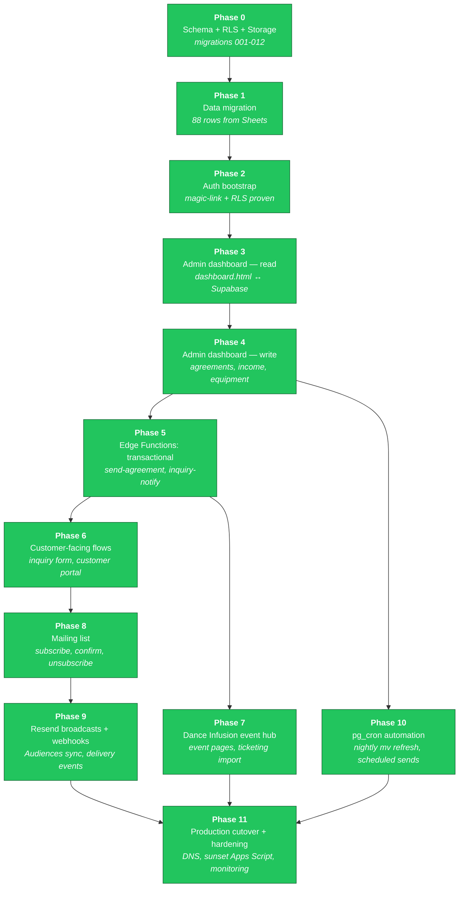
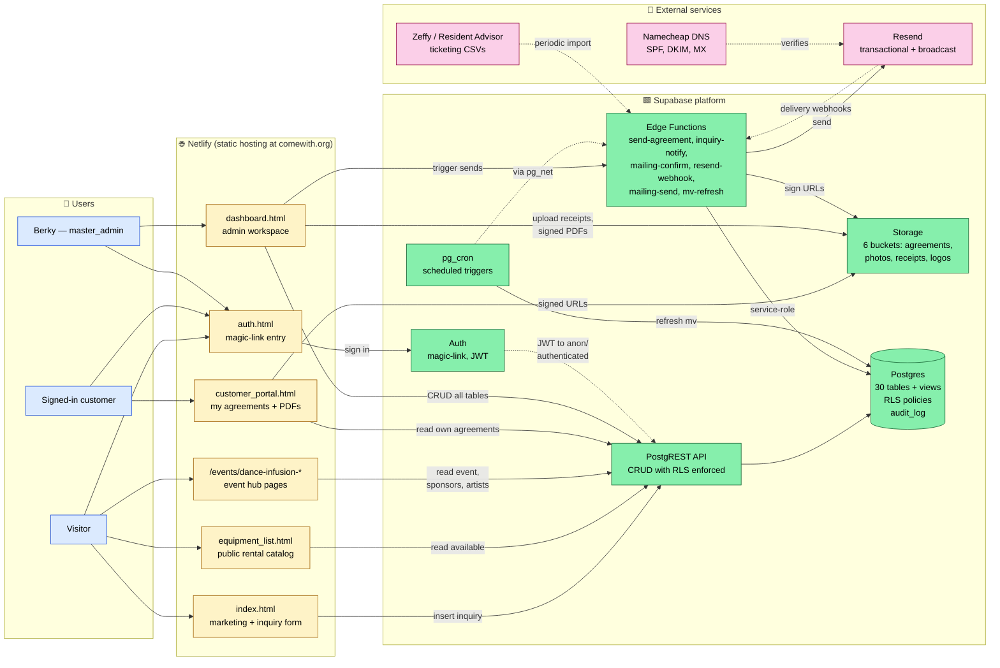

# Come With — Platform Roadmap

This document is the single source of truth for the Supabase migration plan
and the target architecture. Status colors and arrows are current as of
**2026-05-28** (Phase 2 close).

The phase numbering below is a **redesign** of the original Claude-generated
plan. Original used 0-12 with several phases (4, 6, 7, 10, 11, 12) never
specified; "frontend rewrites" was lumped into a single Phase 3 even though
the work spans admin tools, public pages, and an Edge Function backend.
This version uses 12 phases (0-11) with each phase being independently
shippable on staging.

**Status as of 2026-05-28 close of Phase 11**: ALL PHASES DONE. Migration
complete. comewith.org is live on Supabase prod. Known issues + redesign
items collected in project-phase-11-status memory.

---

> ## ⛔ PRIORITY CONTEXT (read first)
> **Come With is MAINTENANCE-ONLY.** The **CWF (Come With Fitness) BRD** is project #1 —
> **soft June 8 / hard June 15, 2026**. Nothing Come With Fitness goes in *this* repo
> (dashboard / schema / pages) until the BRD is done **and** there's an explicit go
> (LEARNINGS §5). Everything below is the Come-With dev roadmap, reconciled **2026-06-02**.

---

## Phase roadmap

### Phase descriptions and dependencies

| # | Name | What it produces | Depends on |
|---|---|---|---|
| 0 ✅ | Schema + RLS + Storage | 30 tables, helper fns, audit triggers, 6 buckets, RLS policies | — |
| 1 ✅ | Data migration | 88 rows imported from Google Sheets (clients, contractors, equipment, expenses, income) | 0 |
| 2 ✅ | Auth bootstrap | magic-link configured, Berky=master_admin, RLS isolation proven | 0 |
| 3 ✅ | Admin dashboard — read | `dashboard-v2.html` reads from Supabase (all 7 admin tables: inquiries, agreements, clients, income, expenses, equipment, events). Magic-link login. No writes yet — read-only de-risks the schema before exposing edits | 2 |
| 4 ✅ | Admin dashboard — write | Inquiry status writes, agreement status writes, "Add income" modal, "Add expense" modal with receipt upload to Storage. Daily ledger work runnable from the dashboard. Full CRUD on clients/equipment/events deferred to 4.5 or Phase 7 | 3 |
| 5 ✅ | Edge Functions: transactional | `send-agreement` (creates token, emails sign link via Resend, marks agreement sent), `get-agreement-by-token` (public, returns agreement for signing page), `mark-signed` (records typed-name signature, notifies all master_admins). `sign.html` customer signing page. Web-based signing — no PDFs. `inquiry-notify` deferred to Phase 6 alongside the public form | 4 |
| 6 ✅ | Customer-facing flows | `index-v2.html` public inquiry form (anon insert via `return=minimal` workaround), `customer_portal-v2.html` shows signed-in customer's agreements with "Review & sign" deep link, `inquiry-notify` Edge Function emails master_admins on new submission. **Anon-RLS resolved** — was a `Prefer: return=representation` quirk, not a policy bug | 5 |
| 7 ✅ | Dance Infusion event hub | DI2 seeded (1 venue, 1 event, 9 sponsors+sponsorships, 5 artists+bookings, 5 raffle prizes, 4 expenses, 16 RA tickets). `events/dance-infusion-2/index-v2.html` public hub via `get-event-hub` Edge Function. Dashboard-v2 admin tabs for sponsors/sponsorships/artists. `import_ticketing.py` CSV importer (RA + extensible for Zeffy) | 5 |
| 8 | Mailing list | Public subscribe form, double-opt-in confirmation, unsubscribe via tokenized URL, segments. Self-hosted per decision #8 | 6 |
| 9 | Resend broadcasts + webhooks | Audiences sync, campaign drafting UI, send queue, webhook handler for `delivered`/`bounced`/`complained` → `mailing_events` table | 8 |
| 10 | pg_cron automation | Nightly materialized view refresh, scheduled mailing sends, audit log retention, weekly digest emails. Lives in `automation_jobs` table; pg_cron calls Edge Functions via pg_net | 4 |
| 11 | Production cutover + hardening | Run migrations on `comewith-prod`, DNS swap if needed, Netlify env vars updated, Apps Script triggers disabled and code archived, monitoring dashboards, backup verification | 7, 9, 10 |

**Why this re-decomposition vs. the original:**

- Original Phase 3 = "frontend rewrites + real-time admin dash" tried to fit
  every HTML page rewrite into one phase. In practice that's weeks of work.
  Splitting into admin-read (P3), admin-write (P4), customer-facing (P6), and
  event hub (P7) lets each ship and prove itself independently.
- Edge Functions weren't in the original plan as their own phase — they were
  implicit in "Phase 9: pg_cron + Edge Functions". But transactional functions
  (send agreement, inquiry notification) need to exist before the customer-
  facing pages can rely on them (P5 → P6).
- Original Phase 5 = "production cutover" was placed early, but it can't
  meaningfully happen until P10 (automation) is verified on staging. Renamed
  P11 and pushed to the end where it belongs.
- Phases 4, 6, 7, 10, 11, 12 in the original were never specified. This
  proposal fills them.

---

## End-state architecture

This is the target state after Phase 11. Apps Script + Google Sheets do not
appear — they're sunset by then.

### Request-flow examples

| Scenario | Path through the system |
|---|---|
| New website inquiry | `index.html` → PostgREST → `inquiries` table (anon INSERT policy) → Resend trigger via `inquiry-notify` Edge Function → Berky's email |
| Customer signs agreement | Berky drafts in `dashboard.html` → PostgREST → `agreements` (admin policy) → `send-agreement` Edge Function generates PDF → uploads to `agreements` Storage bucket → Resend sends signing link → customer clicks tokenized `agreement_links` URL |
| Customer logs in | `auth.html` magic-link form → Supabase Auth sends email → click sets JWT → `customer_portal.html` reads JWT, calls PostgREST with `auth.uid()` → RLS filters `agreements` to their own client only |
| Nightly KPI refresh | `pg_cron` job fires at 03:00 → `pg_net` calls `mv-refresh` Edge Function → function executes `refresh materialized view concurrently mv_cross_event_kpis` (and the other two MVs) |
| Bounce handling | Resend webhook → `resend-webhook` Edge Function (verifies signing secret) → inserts row in `mailing_events` → if event is `bounced`/`complained`, updates `subscribers.status` |

---

## How to read status colors

- 🟢 **green** — phase complete, validated on staging
- 🟡 **yellow** — phase is the next one up, not started
- ⚪ **gray** — planned, dependencies not yet met

Update the `class P# done|next|planned` lines in the Mermaid block as phases
progress. The mermaid diagrams render natively on GitHub and in VSCode/Cursor
preview — no build step required.

---

## Current state — reconciled 2026-06-02

### ✅ Done / shipped — live on prod
- **Migration & cutover (Phases 0–11)** — see the phase roadmap above; comewith.org live on Supabase prod.
- **KPI dashboard** — Strategy tab; Log Event / Log Numbers / Edit Target (incl. create-new + retire-metric); feedback log + Notes; event edit + soft-delete; Add Sponsor; per-event Money panel. (migrations 015–021)
- **Money model fixed (022)** — net P&L now includes ticket revenue; public "% to mission" framing (LEARNINGS §1, §8).
- **Income ↔ events reconciled** — 5 real events created; orphan income cleared.
- **Session close-out ritual** — `SESSION_CLOSE_PROMPTS.md` + `CARRYOVER.md` + `LEARNINGS.md` + `reviews/`.
- **DI #2 impact report + public audit** — gated behind `/staging/`; "% to mission" framing; founder-contribution note. (Not yet public — see Parked: consent sweep.)
- **Reusable password-gated `/staging/` area** — Supabase session gate (`staging/guard.js`).
- **DI #1 folder rename** — `di-01-2024-09 → di-01-2025-09` + report fetch-path fix.
- **DI IG follower metric regrouped** — `instagram.followers.danceinfusion` moved to **audience** workstream (live data fix; all 3 IG-follower metrics now grouped).

### 🟡 Built — committed locally, NOT applied / NOT pushed (awaiting apply + review)
- **Data architecture build 023–028** — actors, actor_roles, event_participants, content_items + tags, workflow (tasks / task_templates / contracts / files / budget_lines / touchpoints), metric_definitions, v_data_points (+ nightly materialized rollup), `tools/visualizer.html`, `tools/test-checklist.html`. **Files-only / held.** Build log: `events/dance-infusion/BUILD_LOG_data_architecture.md`.
- **Optgroup Log Numbers fix** — on branch `fix-lognumbers-optgroups` (pushed as a branch; not merged to master).
- **Close-out commits** — local on `master`, unpushed. (10 held commits total, incl. the above; master stays held.)

### 🚫 Gated dependencies (HARD BLOCKERS — not loose todos)
- **Financial-view security fix** — revoke the 5 financial views (`v_event_summary`, `v_kpi_event_financials`, `v_kpi_parties`, `v_kpi_dance_infusion`, `v_kpi_dashboard`) — **plus** the new `v_budget_variance`, `v_data_points`, `mv_event_data_points` — from `authenticated`, and re-issue as `security_invoker` over RLS-gated tables (admins pass `is_admin()`, non-admins get ZERO rows). **BLOCKS any login below master/sub-admin.** ⚠ Sharpened scope: **`customer`-role logins are also `authenticated`**, and the views are revoked from `anon` only today — so a customer-portal login can already read `v_kpi_*`. This gates **customer-portal logins too**, not just external actors. Negative tests (`tools/test-checklist.html` → Security 🔴) must pass on **staging** first.
- **Architecture apply path** — apply `023–028` to **staging** → eyeball the dedupe in `tools/actor-inspector.html` → run `tools/test-checklist.html` (incl. the external-actor negative tests) → **only then** prod. No unreviewed prod apply.

### ⏸ Parked (each its own session)
- **Actor onboarding + MSA e-signing** — external actors self-onboard, e-sign an MSA, get a scoped login. Depends on the architecture build; **hard-blocked by the financial-view fix** above.
- **Roadmap planning TOOL for Keith + Liz** — buy not build (Notion vs Trello); separate from *this* dev roadmap.
- **`equipment_usage` write-wiring** — schema ready (024 adds `purpose`); wire writes into the Log Event panel.
- **KPI views still read `events.series`** — repoint to `events.type` later (the series exact-match contract is kept for now).
- **DI #1/#2 stat backfill** — plus the dashboard `event_date` fix ("Dance Infusion MS" 2026-09-08 → 2025-09-06).
- **Impact report → public** — consent sweep (sponsors / team / artists / raffle donors; identify the Yankees-hats donor) + fill placeholders (quote, photos, social reach, what's-next) + remove the 2 `/staging/` guard lines; also set dashboard `di.cost_to_raise` target → 60%-to-mission to reconcile with the audit.
- **Flywheel redesign** — cyclical, metric-carrying boxes. Source: `ComeWith_Strategy_Dashboard.html` (in repo).
- **Smaller dev items** — Expenses CSV import; per-event line-item editor (in-place edit of ticket tiers / money rows); reactivate-metric UI; `FORM_DEFS` `created_by`-aware submit handler (fold custom Add-Sponsor form back onto the standard path).

### 🐞 Still-open bugs (carried from earlier — re-verify when next in that flow; not re-verified in this docs pass)
- **Events Services Agreement** — payment-method + recording-rights buttons not interactive; fee fields don't auto-update the total; client info not auto-populating from the Send Agreement link.
- **Dashboard tabs need filter/sort** — Inquiries, Agreements, etc.
